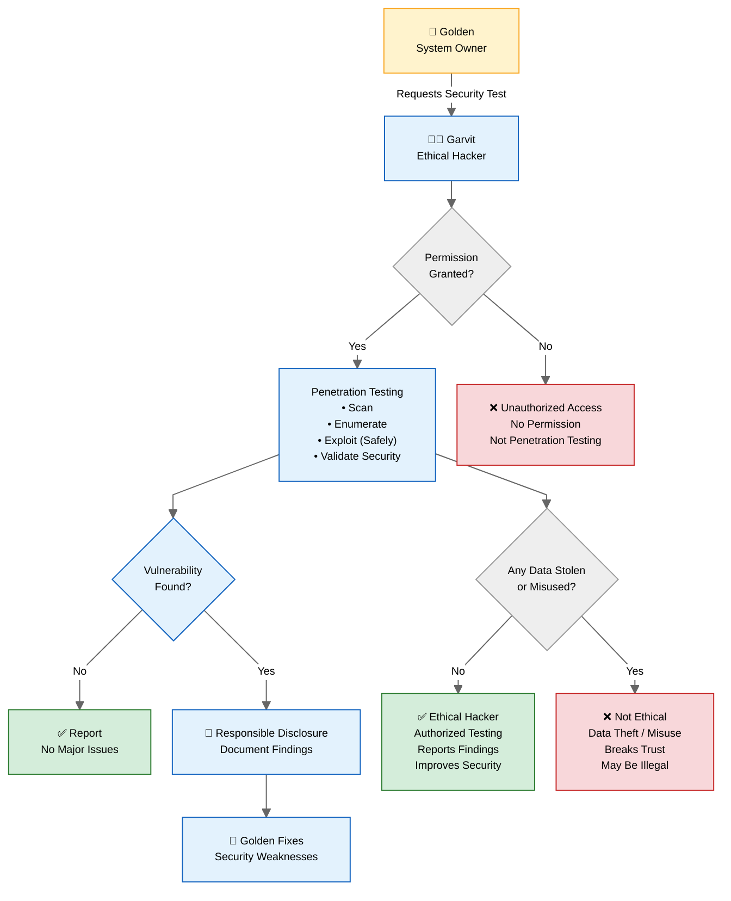

# Ethical Hacking
Locating the weakness and vulnerabilities 

## Types of Hackers
1. [[Whitehat hackers]] : They have permission, to get into the system
2. [[Blackhat hackers]] : They dont have permission to break the system, or get in. Also their intentions are bad as well.
3. [[Greyhat hackers]] :  They dont have the permission, but intentions are not of breaking or hurting anyone. They get in just for fun, or for learning purposes
4. [[Script kiddies]] : they uses tool without knowing how/why/what to do with it. They are just curious and runs it without knowing the impact. They just copy paste uses tool.
5.  [[Hackvists]] :  Blackhat hackers, but wanna do good for soceity by targetting the wrong ones - they are like kira
6. [[Terrorists]] - All bad intend
7. [[State-Sponsored]] - Government trying to spy/hack for the purpose of national security

# Think as in

I am gonna break the system, if got in not gonna steal data but instead gonna give report that how i made it possible to get into system - I am penetration tester 
You give my report to someone - who drafts the policy for company and provides solution / protects network = Security Tester

- <u>Penetration Tester</u> : Legally hirded to know how deep they can penetrate the system - iykyk
- <u>Security Tester</u> : Documenting , explaining how to fix 

# Some Terminologies
- [[Hacking]] - Finding and using weakness
- [[Cracking]] - breaking , breaching (Cracking password hash)
- [[Spoofing]] - Using False identity
- [[Denial of Services]] - DoS Floods server with too many requests until it cant serve real users. DDoS have multiple attackers. Dos have single
- [[Port Scanning]] - Checking which door is open to get enter into system, which is listening - its basically information gathering.

# Gaining Access
- [[Front Door]]: Password guessing/stealing (common).
- **[[Back Doors]]**: Often left by original developers to debug if in future something happens. but maliciously can be used
- **[[Trojan Horses]]**: Hidden malicious code in legit software (or hardware chips mein extra circuitry).
- **Software Vulnerability Exploitation**: Unpatched bugs use karo. Script kiddies yahin se shuru karte hain.

# Once Inside hackers can
- Modify the logs
- Steal the files
- Manipulate the data
- Install back doors
- attack other systems 

# Tester Roles & Methodologies:
1. [[Tiger Box]] - One system which is already loaded with the hacking tools. Basically portable machine with loaded bullets.
2. [[White Box Model]] - Its basically sab jan lo, company givves all network topology, technology and passwords. Full internal knowledge 
3. [[Blackbox testing]] - Company gives nothing, tester have to find everything 
4. [[Gray box model]] - Hybrid of white and black model, partial information is granted.