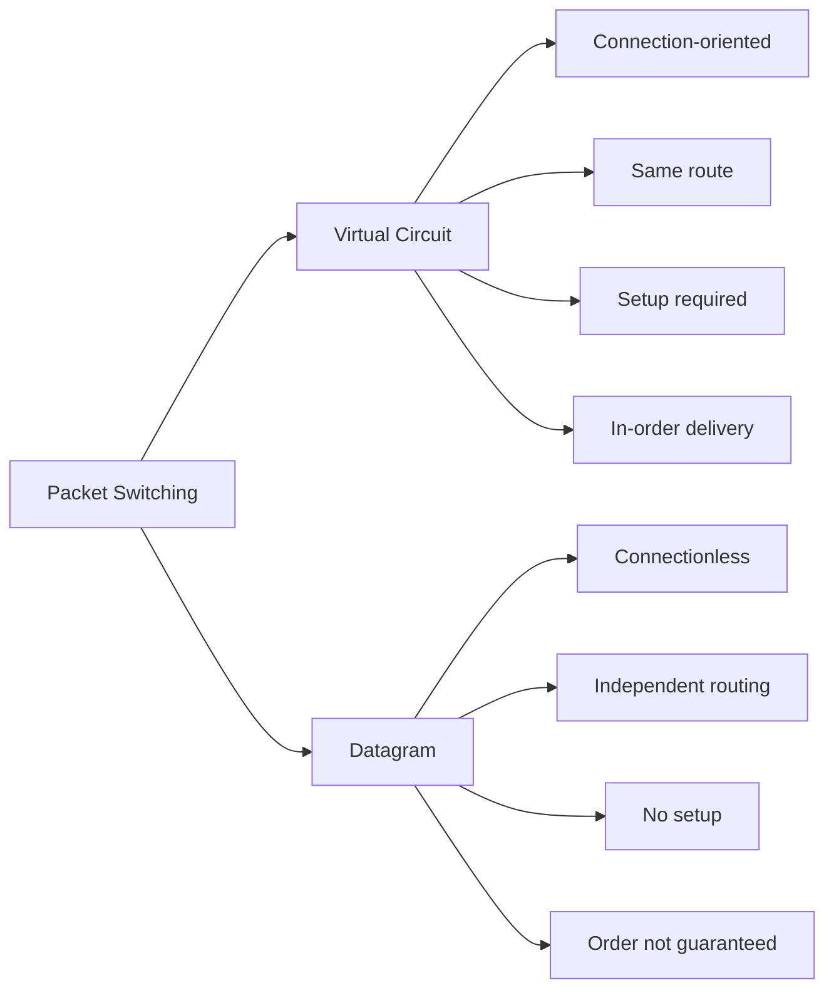

Continuity of [[Lecture-02-Basic-Concepts-of-Networking-I]]

b. [[Datagram Approch]] - 
1. It doesn't require predefine route.
2. The message is broken into smaller chunks called packets which is later transmitted as an independent entity
3. Independent entity - packets have a header with all the destination's information (Full source + destination)
4. Intermediate nodes(Routers) takes dynamic decision as per the routing table.
 - <u>Analogy - [[Postal System]]</u> : Like the letter is independent of other letters. And still reaches the destination cause of the address and other necessary information mentioned on them. (Order guarantee nahi, loss ho sakta hai, duplicate bhi ho sakta hai)
 
**Steps:**
1. A long message is divided into smaller packets.
2. Each router checks its routing table and forwards the packet through the most efficient available path.
3. Each packet is routed independently.
4. [[Lecture-02-Basic-Concepts-of-Networking-I|Store-and-Forward]] is followed at every router before forwarding the packet.

**Problems:**
- <u>Out of Delivery</u> : A packet takes longer path whereas B packets take shorter path - the receiver have to wait for the right packet first.
- <u>Packet Loss</u>  : The path got blocked due to failure of any node result in packet being stuck.
- <u>Duplicates</u> : If the sender receives the acknowledgement  too late, the sender in between thinks the receiver havent received its packet yet. So it sends the new one. Making duplication of packets.

**Advantages:**
- No initial setup required - the routes are chose dynamically
- Good for small number of packets
- Most widely used technology (So exploit it)
- Datagram switching is highly scalable and can handle large amounts of traffic on a network.
- Faster in circulating the message if smaller number of packets

#hackingPov Datagram ki wajah se IP Spoofing, Packet Sniffing, Fragmentation Attacks, aur DoS (flood with junk packets) possible hai.

# Delays in Network Communication

There are 4 types of delays in network communication ie [[Propagation Delay]], [[Transmission Delay]], [[Processing Delay]], [[Queueing Delay]]
<ol type="A"> 
<li>
<h3>Propagation Delay: </h3> 
It is the time taken by a data signal to travel through the transmission medium from the sender to the receiver after it has been transmitted. It starts when the first bit enters the medium and ends when that bit reaches the destination.   Depends on:  Distance + Medium - copper, fibre, satellite.
 </li> 

<li>
<h3>Transmission Delay: </h3> 
It is the amount of time needed to send all the bits of a data packet from the sender onto the communication medium. Size/Bandwidth.
 </li> 
<li>
<h3>Processing Delay: </h3> 
Router stores the packet + checks the routing table and then forwards to the medium - time time taken in this is called processing delay.
 </li> 

</ol>

![[networkDelays.png|1000]]

| **Delay Type**         | **Definition**                                                                                                                                                                       | **Formula**                      | **Depends On**                                                                                               | **Example**                                                                                | **Can be Reduced By**                                                          |
| ---------------------- | ------------------------------------------------------------------------------------------------------------------------------------------------------------------------------------ | -------------------------------- | ------------------------------------------------------------------------------------------------------------ | ------------------------------------------------------------------------------------------ | ------------------------------------------------------------------------------ |
| **Propagation Delay**  | Time taken by the **first bit** of a packet to travel from the sender to the receiver through the transmission medium after transmission begins.                                     | **Distance / Propagation Speed** | • Distance between sender and receiver • Type of transmission medium (Copper, Fiber, Wireless, Satellite) | A signal traveling **3000 km** takes longer than one traveling **30 km**.                  | Reducing the physical distance or using a faster medium (e.g., optical fiber). |
| **Transmission Delay** | Time required to **push all bits** of a packet onto the communication link. It ends when the last bit has been transmitted.                                                          | **Packet Size / Bandwidth**      | • Packet size (bits) • Link bandwidth (bps)                                                               | Sending a **100 MB** file takes longer than sending a **1 MB** file over the same network. | Increasing bandwidth or reducing packet size.                                  |
| **Processing Delay**   | Time taken by a router or switch to process the packet, check for errors, examine the header, determine the next hop using the routing table, and prepare the packet for forwarding. | No fixed formula                 | • Router CPU speed • Routing table lookup • Error detection • Firewall/NAT/ACL processing           | A router receives a packet, checks its destination IP, and decides where to forward it.    | Using faster networking devices or reducing processing overhead.               |
| **Queuing Delay**      | Time a packet waits in the router's queue before it can be transmitted because other packets are being processed first.                                                              | No fixed formula                 | • Network congestion • Queue length • Traffic load                                                     | During peak network usage, packets wait in a queue before transmission.                    | Reducing congestion or increasing bandwidth.                                   |

### In Circuit Switching 
- Only initial setup delay
- After setup, we have dedicated path -> continuous max speed, almost no delay
### In Virtual Circuit 
1. [[Call Request]] Packet jaata hai source (A) se destination (H) tak. Iska kaam hai: Poore raaste (A→B→E→H) ko fix karna aur saare routers ke routing table mein VC# (Virtual Circuit Number) daal dena.
2. Jab destination (H) ko yeh Call Request packet pahunch jaata hai aur woh ready hota hai, tab woh [[Call Accept]] Packet bhejta hai wapas source (A) ki taraf - same fixed path se.
3. [[Call Accept Delay]] = Woh time jo Call Accept Packet ko destination se source tak lautne mein lagta hai.
4. Matlab:
-            Call Request gaya (forward journey)
-            Call Accept aaya (return journey)
Is total round-trip setup time ko hum broadly [[call setup delay]] kehte hain, jisme Call Accept Delay important hissa hai.

![[delaySetup.png]]
### In Digital gram Packet Switching 
- No setup delay.
- fHar packet independent → total time zyada ho sakta hai agar packets bohot hain, lekin flexible.

# Layered Network Architecture – [[OSI 7-Layer Model]]

My resource: [Link](https://youtu.be/CRdL1PcherM?t=372&si=PGKtqFMuv-dxMlXJ) , CEH books
We use Tcp/Ip everytime but we talk about OSI always
![[ositcp.png]]

| Layer | Name         | Main Function                                                                                | Detailed Explanation                                                                                                                                                                                                                   |
| ----: | ------------ | -------------------------------------------------------------------------------------------- | -------------------------------------------------------------------------------------------------------------------------------------------------------------------------------------------------------------------------------------- |
|     7 | Application  | Provides network services to end-user applications.                                          | The closest layer to the user. It allows software like web browsers, email clients, and file transfer applications to communicate over the network. Protocols: HTTP, HTTPS, FTP, SMTP, DNS.                                            |
|     6 | Presentation | Data translation, encryption, and compression.                                               | Ensures data is in a format both sender and receiver understand. Handles character encoding (ASCII, Unicode), encryption/decryption (SSL/TLS), and data compression to improve efficiency.                                             |
|     5 | Session      | Establishes, manages, and terminates communication sessions.                                 | Creates and maintains sessions between applications, synchronizes communication, manages checkpoints, and recovers interrupted sessions. Example: RPC, NetBIOS.                                                                        |
|     4 | Transport    | End-to-end delivery, reliability, and error recovery.( open, maintain, and close a session.) | Breaks data into segments, ensures reliable delivery, performs flow control, error checking, retransmission, and uses port numbers to identify applications. Protocols: TCP (reliable), UDP (fast, connectionless).                    |
|     3 | Network      | Routing and logical addressing.                                                              | Determines the best path for data to travel across networks. Uses logical IP addresses and routers to forward packets between different networks. Protocols: IP, ICMP, OSPF, RIP.                                                      |
|     2 | Data Link    | Node-to-node delivery and error detection.                                                   | Transfers data between devices on the same local network. Uses MAC addresses, frames, error detection (CRC), and controls access to the physical medium. Devices: Switches, Bridges. Protocols: Ethernet (802.3), Wi-Fi (802.11), PPP. |
|     1 | Physical     | Transmission of raw bits over the medium.                                                    | Defines electrical, optical, and mechanical characteristics for transmitting binary data. Includes cables, connectors, radio signals, voltages, and network hardware like hubs and repeaters.                                          |

## Trick to Remember
> **All People Seem To Need Data Processing**

- **A** → Application (7)
- **P** → Presentation (6)
- **S** → Session (5)
- **T** → Transport (4)
- **N** → Network (3)
- **D** → Data Link (2)
- **P** → Physical (1)
# OSI 7 Layer Model (Hindi)

| Layer | Layer Ka Naam       | Kya Karta Hai (Simple Hindi) |
|-------|---------------------|------------------------------|
| 7     | **Application**     | User aur network ke beech interface banati hai. Email, browser, FTP jaise apps yahin chalte hain. |
| 6     | **Presentation**    | Data ko format karti hai, encryption, compression, translation karti hai. Data ko network ke liye ready karti hai. |
| 5     | **Session**         | Session manage karti hai (login, logout, connection maintain). Do applications ke beech baat chalati hai. |
| 4     | **Transport**       | End-to-end reliable data delivery. TCP aur UDP yahin kaam karte hain. Error recovery aur flow control. |
| 3     | **Network**         | Packet routing karti hai. IP address se packet ko sahi destination tak pahunchati hai. Router yahin kaam karta hai. |
| 2     | **Data Link**       | Point-to-point link pe reliable frame bhejti hai. Error check, MAC address, flow control. Switch yahin kaam karta hai. |
| 1     | **Physical**        | Raw bits (0 aur 1) ko physical wire, cable, fiber ya wireless mein bhejti hai. Voltage, signal, hardware level. |

**Extra Note:**
- Upper 4 layers (4-7): Sirf source aur destination mein active (Host-to-Host)
- Lower 3 layers (1-3): Har router/switch mein active (Point-to-Point)

![[osi.png]]

## **Data Flow (Stack)**:

- Sender: Application → ... → Physical (headers add hote jaate hain).
- Intermediate: Physical → Data Link → Network → reverse for forwarding.
- Receiver: Physical → ... → Application (headers remove).
- ![[dataFlow.png]]

### **Advantages of Layering**:

- Systematic design.
- Ek layer change karo, dusre pe asar nahi.
- Maintainability badhti hai.

### **Internetworking Devices**:

- **[[Hub]]** (Physical): 
	1. Signal repeat karta hai, simple broadcast. Extends Span of single LAN

- **[[Bridge / L2 Switch]]** (Data Link): 
	1. MAC address se forward, LAN segments connect.
	2. Connects 2 or more LAN together

- **[[Router / L3 Switch]]** (Network): IP routing, LAN to WAN connect.

**Typical Network Structure**: Hubs → L2 Switches → L3 Switch/Router → External Router.