# [[01 Patents in India]]
> [!SUMMARY]
> A **patent** is an exclusive legal right granted by the Government for an invention. It gives the patent owner the exclusive right to commercially exploit the invention for a limited period in exchange for full public disclosure of the invention.

## Patent Lifecycle in India

```text
Idea / Invention
        │
        ▼
Patent Application Filed
        │
        ▼
Patent Prosecution
(Examination & Objections)
        │
        ▼
Patent Granted
        │
        ▼
Patent Enforcement
(Infringement Litigation)
```

### Patent Prosecution

Patent prosecution is the process between the applicant and the Patent Office involving:

- Filing the patent application
- Examination by the Patent Office
- Responding to objections (FER)
- Amendment of claims (if required)
- Grant or refusal of the patent

### Patent Enforcement

After grant, the patent owner may enforce the patent against infringement through the courts.

It involves:

- Identifying infringement
- Filing a suit before the competent court
- Seeking remedies such as injunctions and damages


# Fundamentals of Patent

A patent is:

- An **exclusive monopoly right** conferred by the Government.
- A **territorial right**, enforceable only in the country where it is granted.
- Granted for a **period of 20 years** from the date of filing.

### Exclusive Rights

The patent owner has the exclusive right to:

- Make
- Use
- Sell
- Offer for sale
- Import
- License or assign the invention

# Purpose of Patents

Patents aim to:

- Encourage innovation
- Reward inventors
- Promote research and development
- Encourage disclosure of technological knowledge
- Balance private rights with public interest after expiry

# Patent Law in India

## Early Patent Law

### Indian Patents and Designs Act, 1911

- First comprehensive patent legislation during British rule.
- Based largely on the British patent system.


## Committees Before the 1970 Act

### Tek Chand Committee

- Examined whether the existing patent law suited India's needs.

### Ayyangar Committee

- Recommended major reforms.
- Emphasized national development, access to technology, and prevention of abuse of patent rights.
- Formed the basis of the Patents Act, 1970.

## Patents Act, 1970

- Enacted to promote national development.
- Favoured public interest and indigenous technological growth.
- Initially provided stronger protection for **process patents** in certain sectors.

## Patent (Amendment) Acts

| Amendment | Purpose |
|-----------|---------|
| **1999** | Introduced TRIPS transitional obligations and the "mailbox" system for pharmaceutical and agrochemical product patents. |
| **2002** | Modernized patent law, revised definitions, and aligned further with TRIPS. |
| **2005** | Introduced **product patents** in all fields of technology to achieve full TRIPS compliance. |


## Patent Rules

| Rules | Key Change |
|--------|------------|
| **2003** | Introduced procedural rules under the Patents Act. |
| **2005** | Updated procedures after the 2005 Amendment Act. |
| **2006** | Simplified filing and examination procedures. |
| **2013** | Improved procedural efficiency and electronic processing. |
| **2014** | Streamlined patent administration and filings. |
| **2016** | Introduced expedited examination and promoted faster patent processing. |

# Product Patent vs Process Patent

| Product Patent | Process Patent |
|---------------|----------------|
| Protects the product itself | Protects only the method of manufacturing |
| Others cannot make the same product by any method | Others may manufacture the same product using a different process |
| Stronger protection | Comparatively narrower protection |

India presently recognizes **both product and process patents**.

# Patent Specification

> [!IMPORTANT]
> A patent is granted **only after complete disclosure of the invention** through the patent specification.

## Patent Specification

A patent specification consists of:

- **Description**
- **Claims**

## Contents of Description

- Title of the invention
- Technical field / Background
- Prior art
- Summary of the invention
- Detailed description
- Working of the invention
- Advantages
- Drawings (where required)
- Abstract

## Claims

Claims define:

- The legal boundaries of the invention
- What is protected
- What others are prohibited from doing

> [!NOTE]
> **Description explains the invention.**  
> **Claims define the legal protection.**


## Patent Specification Structure

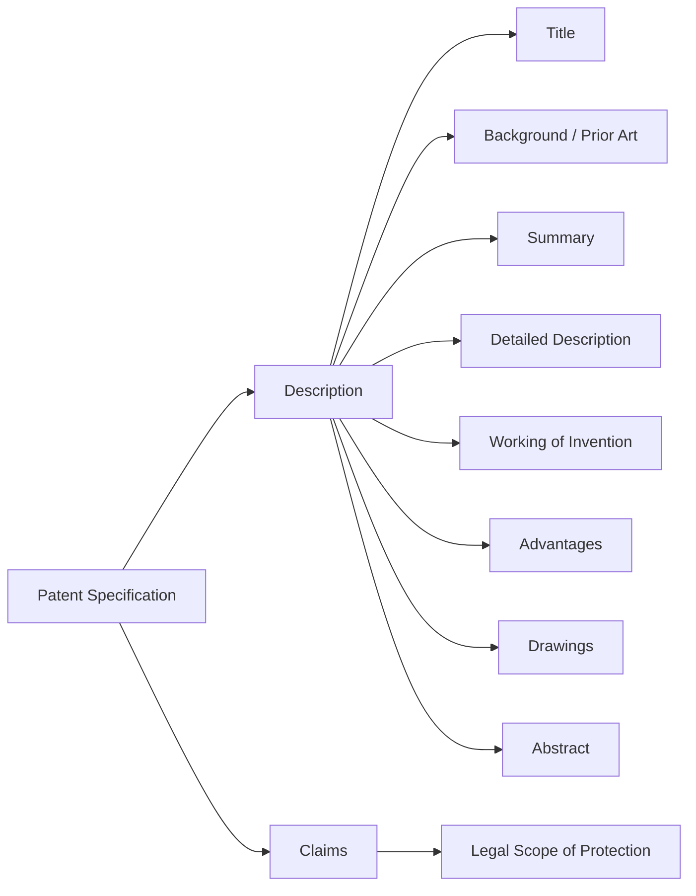

---

# To Whom is a Patent Specification Addressed?

A patent specification is a unique legal and technical document.

It is prepared by:

- Patent agents
- Patent attorneys
- Inventors
- Technical experts

It is intended for different audiences.

## Person Skilled in the Art (PSITA)

The specification is primarily addressed to a hypothetical person who:

- Possesses ordinary technical knowledge in the relevant field.
- Can understand and reproduce the invention after reading the specification.

> [!IMPORTANT]
> The invention must be described clearly enough that a **Person Skilled in the Art (PSITA)** can perform it.

## Legal Audience

Patent specifications are also interpreted by:

- Patent Examiners
- Controllers
- Patent Agents
- Judges
- Lawyers

Especially during examination and infringement litigation.

# Section 10(1) – Patents Act, 1970

> **"Every complete specification shall fully and particularly describe the invention and its operation or use and the method by which it is to be performed."**

This provision requires:

- Full disclosure
- Clear description
- Sufficient detail for a skilled person to perform the invention

# Structure of a Published Patent Document

A published patent generally contains:

1. Patent Number
2. Application Number
3. Filing Date
4. Publication Date
5. Title of the Invention
6. Name of Applicant
7. Name of Inventor(s)
8. Priority Details (if any)
9. Abstract
10. Drawings / Figures
11. Description
12. Claims

> [!NOTE]
> The **patent number**, **application number**, **inventor's name**, and **filing details** help identify and trace the patent in patent databases.
# Sample Structure of a Patent

```text
----------------------------------------------------
Patent Number

Application Number
Filing Date
Publication Date

Title of Invention

Applicant
Inventor(s)

Abstract

Figure 1

Description
--------------------------------
Background
Prior Art
Summary
Detailed Description
Examples

Claims
1.
2.
3.
...
----------------------------------------------------
```

---
# [[02 Who Can Apply for a Patent?]]

> [!SUMMARY]
> Under the **Patents Act, 1970**, a patent application may be filed by the inventor, an assignee, a legal representative, or jointly by eligible applicants.

## Eligible Persons

### 1. True and First Inventor

The **true and first inventor** is the person who actually conceived and made the invention.

- Must be a **natural person**.
- Is entitled to apply for a patent in their own name.
- May apply individually or jointly with others.

> [!NOTE]
> The **true and first inventor** is the actual creator of the invention, not merely the first person to file the application.

## 2. Assignee of the True and First Inventor

An **assignee** is a person or organization to whom the inventor has transferred the right to apply for a patent.

Examples:
- Company
- Employer
- Research Institution
- Individual
- 
The assignee becomes the applicant through a valid assignment.

### Conditions

The assignee must establish that:
- They are **in possession of the invention** through a lawful assignment.
- There is **no lawful ground of objection** to the grant of the patent in their favour.

## 3. Joint Applicants

A patent application may be filed jointly by:
- Two or more inventors
- Two or more assignees
- Eligible persons having a joint entitlement

## 4. Legal Representative

If the inventor dies before or during the patent process, the application may be filed or continued by the **legal representative**.

The legal representative:
- Represents the estate of the deceased person.
- Exercises the rights that would have belonged to the deceased inventor.

## Patent Agent

A **Patent Agent** is an authorized professional registered under the Patents Act who represents the applicant before the Patent Office.

A patent agent may:
- Draft the patent specification
- File the application
- Respond to examination reports
- Represent the applicant before the Patent Office

> [!IMPORTANT]
> A patent agent is **neither the inventor nor the applicant** unless they independently satisfy those requirements. They act only as an **authorized representative**.

## Mention of the Inventor

Even when the applicant is an assignee or legal representative, the application must mention the **true and first inventor**.

> [!NOTE]
> **Applicant** = Person entitled to obtain the patent.  
> **Inventor** = Person who actually made the invention.

## Relationship

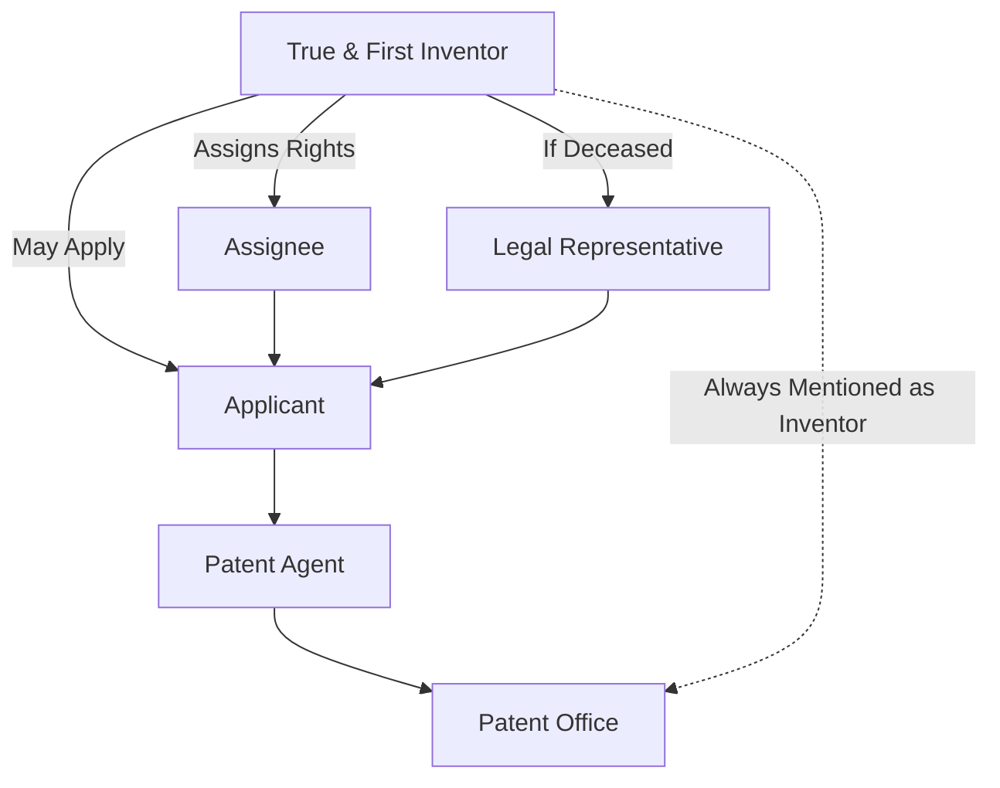

## Quick Revision

| Person | Role |
|---------|------|
| True & First Inventor | Actual creator of the invention |
| Assignee | Person/entity who acquires patent rights |
| Joint Applicant | Two or more eligible applicants |
| Legal Representative | Represents the estate of a deceased inventor/applicant |
| Patent Agent | Authorized representative before the Patent Office |

---
# [[03 Requirements of a Patent Application]]

> [!SUMMARY]
> A patent application must be accompanied by the prescribed documents and forms under the **Patents Act, 1970** and the **Patent Rules, 2003**. These documents establish the applicant's entitlement, disclose the invention, and enable examination by the Patent Office.

## 1. Provisional or Complete Specification

A patent application must be accompanied by either:

### Provisional Specification

- Filed when the invention is not yet fully developed.
- Secures the **priority date** of the invention.
- Must be followed by a **Complete Specification within 12 months** from the date of filing.

### Complete Specification

Contains the full disclosure of the invention, including:

- Description
- Claims
- Abstract
- Drawings (where required)

> [!IMPORTANT]
> Failure to file the **Complete Specification within 12 months** of filing the Provisional Specification results in the application being **deemed abandoned**.

## 2. Drawings

Drawings are required when they are necessary to explain the invention.

They should:

- Clearly illustrate the invention.
- Correspond with the description in the specification.
- Help a person skilled in the art understand the invention.

## 3. Foreign Filing Details (Form 3)

The applicant must submit **Form 3**, containing:

- Details of corresponding foreign patent applications.
- A statement and undertaking regarding foreign filings for the same or substantially the same invention.

This enables the Patent Office to monitor related foreign applications.

## 4. Priority Document

Required when claiming **priority from a Convention Application or PCT Application**.

The applicant must submit either:

- A certified copy of the priority application, **or**
- A request for the Indian Patent Office to retrieve the document through the **Digital Access Service (DAS)**.

## 5. Declaration of Inventorship

The application must contain details of the inventor(s), including:

- Name
- Nationality
- Address

This declaration identifies the **true and first inventor**.

## 6. Power of Attorney (Form 26)

Required when the application is filed through a **Patent Agent**.

Form 26 authorizes the Patent Agent to:

- File the application
- Communicate with the Patent Office
- Represent the applicant during prosecution.

## 7. Prescribed Fees

The prescribed government fee must be paid at the time of filing.

The amount depends on the category of the applicant, such as:

- Natural Person
- Startup
- Small Entity
- Other Entity

## 8. Proof of Right *(Removed Requirement)*

Earlier, where the application was filed by an **assignee**, proof of the applicant's right to apply for the patent had to be submitted.

> [!NOTE]
> This requirement has since been **removed** under the amended Patent Rules.

## Flow of a Patent Application

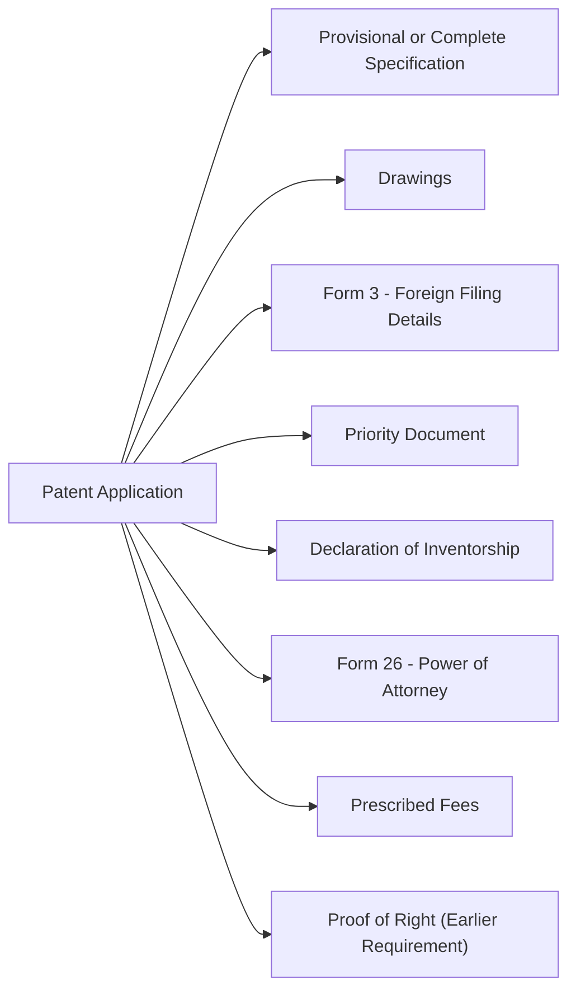

## Quick Revision

| Requirement | Purpose |
|--------------|---------|
| Provisional Specification | Secures the priority date |
| Complete Specification | Fully discloses the invention |
| Drawings | Explain the invention visually |
| Form 3 | Foreign filing statement and undertaking |
| Priority Document | Claims priority from an earlier application |
| Declaration of Inventorship | Identifies the true and first inventor |
| Form 26 | Authorizes a Patent Agent |
| Prescribed Fees | Mandatory filing fee |
| Proof of Right | Earlier required for assignees (now removed) |

---
# [[04 Types of Patent Applications]]

> [!SUMMARY]
> The **Patents Act, 1970** provides different types of patent applications depending on the origin of the invention, priority claims, international filings, and procedural requirements.

## 1. Ordinary Application (Section 7)

An **Ordinary Application** is the standard patent application filed directly in India.

### Features

- Filed without claiming priority from any earlier application.
- May be accompanied by a **Provisional** or **Complete Specification**.
- Used when the invention is first filed in India.

> [!NOTE]
> This is the most common type of patent application.

## 2. Convention Application (Section 135)

A **Convention Application** is filed in India by claiming priority from an earlier application filed in a **Convention Country**.

India is a member of the **Paris Convention**.

### Features

- Claims the priority date of the first application filed in a Convention country.
- Must generally be filed in India within **12 months** from the first filing.
- Preserves the novelty of the invention based on the earlier filing.

## 3. PCT International Application

A **PCT (Patent Cooperation Treaty) International Application** is filed under the **Patent Cooperation Treaty (PCT)**.

### Features

- A single international application can designate multiple PCT member countries.
- Simplifies international patent filing.
- Does **not** grant an international patent.

> [!IMPORTANT]
> The PCT provides a **common filing procedure**, not a worldwide patent.

## 4. PCT National Phase Application (Section 7(1A))

A **PCT National Phase Application** is filed when the applicant enters the **Indian National Phase** after filing a PCT International Application.

### Features

- Filed under **Section 7(1A)**.
- Serves as the **entry point** into the Indian patent system.
- The application is examined under the Indian Patents Act.

## 5. Patent of Addition (Section 54)

A **Patent of Addition** is granted for an improvement or modification of an invention already covered by a main patent.

### Features

- Can be granted only if a **main patent** exists.
- Protects improvements or modifications.
- Avoids filing a completely separate patent for minor improvements.

> [!NOTE]
> A Patent of Addition is dependent upon the main patent.

## 6. Divisional Application (Section 16)

A **Divisional Application** is filed when a patent application contains **more than one invention**.

### Features

- Divides one application into separate applications.
- Ensures compliance with the **unity of invention** requirement.
- Retains the filing date of the original application for the disclosed subject matter.

## Relationship Between Different Patent Applications

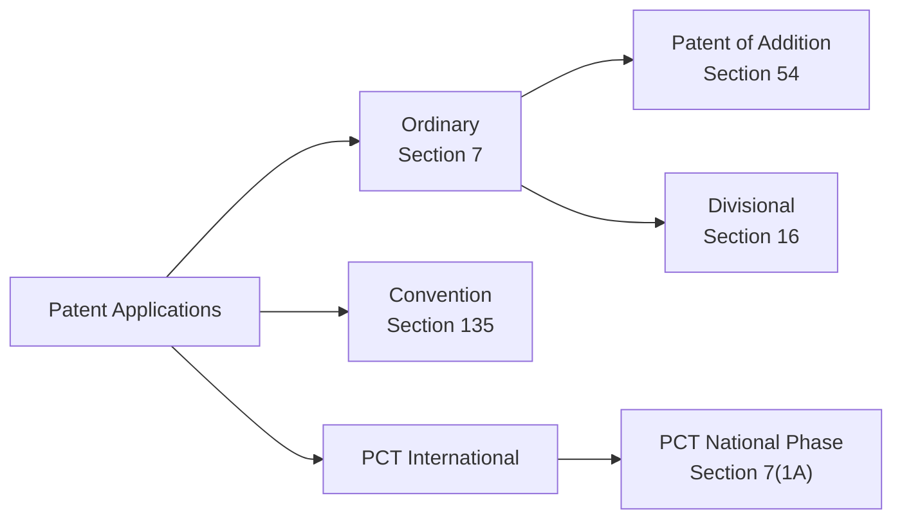

## Quick Revision

| Type                          | Section       | Purpose                                                        |
| ----------------------------- | ------------- | -------------------------------------------------------------- |
| Ordinary Application          | Section 7     | First filing in India without claiming foreign priority        |
| Convention Application        | Section 135   | Claims priority from a Convention country (Paris Convention)   |
| PCT International Application | PCT           | Single international filing for multiple countries             |
| PCT National Phase            | Section 7(1A) | Entry into the Indian patent system after a PCT filing         |
| Patent of Addition            | Section 54    | Protects improvements or modifications of a patented invention |
| Divisional Application        | Section 16    | Separates multiple inventions disclosed in one application     |

---
# [[05 Trademarks]]

> [!SUMMARY]
> A **Trademark** is a sign capable of distinguishing the goods or services of one business from those of another. It helps consumers identify the source of products, assures quality, and protects the goodwill and reputation of a business.

## Business and Trade

A **business** is an organized commercial activity involving the exchange of goods or services for value.

### Elements of a Business Transaction

#### 1. Interaction

A business transaction involves an exchange or dealing between parties.

**Parties:**
- Buyer
- Seller

#### 2. Subject Matter

The exchange may involve:
- Goods
- Services

#### 3. Value

The exchange takes place for consideration, such as:
- Money
- Other valuable goods or services

## Essentials of a Business

Every business requires:

- Investment of capital and resources.
- Customers willing to purchase its goods or services.
- Continuous promotion and marketing.
- Profit through successful sale of goods or services.

To compete effectively, businesses create a unique identity through:
- Brand
- Business name
- Logo
- Trade dress (get-up)
- Packaging

These help consumers distinguish one business from another.

## What is a Trademark?

A **Trademark** is:

> **Any word, name, symbol, device, label, logo, shape, combination of colours, or any other distinctive mark used to identify and distinguish the goods or services of one person from those of others.**

The primary purpose of a trademark is to indicate the **commercial source** of goods or services.

## Historical Origin of Trademarks

### Ancient Times
- Craftsmen placed **signature marks** on their products.
- These marks identified the maker of the goods.

### Middle Ages

Growth in trade increased the use of:
- Signs
- Symbols
- Merchant marks

These helped distinguish one trader's goods from another's.

### Industrial Revolution

Industrialization resulted in:
- Mass production
- Large markets
- Multiple manufacturers producing similar goods

Consumers required a reliable method to distinguish products based on:
- Source
- Quality
- Reputation

This led to the modern trademark system.

## Functions of a Trademark

### 1. Origin Function

A trademark identifies the **source or origin** of goods or services.
**Example:** The Apple logo indicates that the product originates from Apple Inc.

### 2. Quality or Guarantee Function

Consumers associate trademarks with a consistent level of quality.
**Example:** A consumer purchasing a branded medicine expects the same quality every time.

### 3. Advertising and Investment Function

Businesses invest heavily in trademarks through:
- Advertising
- Marketing
- Brand promotion

A successful trademark becomes a valuable commercial asset.

### 4. Information Function

A trademark provides information that helps consumers make purchasing decisions.
Instead of reading detailed product specifications every time, consumers often rely on a familiar trademark.

## Importance of Trademarks

A trademark:
- Identifies products in the market.
- Distinguishes competitors.
- Builds customer trust.
- Represents the reputation and goodwill of a business.
- Helps consumers make informed purchasing decisions.
- Creates brand value.

## Development of Trademark Protection

### 16th Century

Trademark protection primarily focused on:
- Indicating the source of goods.
- Preventing fraud and deception.

### 19th Century – Passing Off

Before statutory trademark registration, protection was available through the common law action of **Passing Off**.

The trader had to establish:
- Goodwill or reputation.
- Misrepresentation by another trader.
- Damage resulting from the misrepresentation.

> [!NOTE]
> Passing Off protects **business goodwill**, even for an unregistered trademark.

### Trademark Registration (1875)

Statutory registration systems were introduced to simplify protection.

Registration reduced the burden of proving:
- Goodwill
- Reputation
- Distinctiveness (in many situations)

It also provided stronger statutory rights.

## Advantages of Registration

Registration enables the proprietor to:
- Obtain protection even before extensive commercial use.
- Enforce statutory rights more easily.
- Assign the trademark.
- License the trademark.
- In certain situations, assign the trademark independently of the goodwill of the business.

## Why Protect Trademarks?

Trademark protection serves several purposes.

### Protection of Consumers

Consumers are protected from confusion and deception.
**Example:** A customer intending to buy **Nike** shoes should not be misled into purchasing shoes bearing a deceptively similar mark such as **Nikey**.

### Protection of Traders

Businesses invest substantial time and money in building reputation.
Trademark law prevents competitors from unfairly benefiting from that reputation.

### Preservation of Uniqueness

Protection preserves the distinct identity of a trademark and prevents unauthorized imitation.

### Encouragement of Fair Competition

Businesses compete through:
- Better quality
- Innovation
- Service

rather than by copying another trader's reputation.

## Is a Trademark a Monopoly?

A trademark **does not create a monopoly over the goods or services themselves**.
It grants exclusive rights **only over the use of the trademark** in relation to those goods or services.
**Example:** Many companies may manufacture smartphones. However, only Apple Inc. may use the trademark **Apple** for its products.

## Justifications for Trademark Protection

### 1. Creativity

Businesses invest creative effort in developing distinctive names, logos, packaging, and brand identity.

### 2. Association Between Trader and Public

Over time, consumers associate a trademark with a particular trader.

This association creates:
- Trust
- Reputation
- Goodwill

### 3. Market Information

Trademarks reduce consumer search costs by helping buyers quickly identify products from a trusted source.

### 4. Fairness

It would be unfair if one trader could benefit from another trader's reputation without making the same investment.
**Example:** Suppose Company A spends years building the reputation of its brand **SUNPURE**.
If Company B starts selling similar products under **SUNPUREE** with similar packaging, customers may believe both products originate from the same source.

Trademark law prevents Company B from unfairly exploiting Company A's goodwill.

## Functions of a Trademark

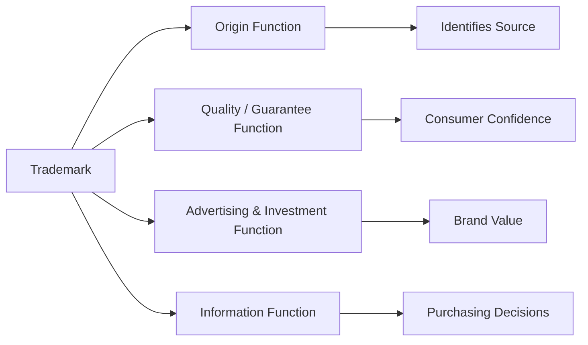


---
# [[06 Trademarks in India]]

> [!SUMMARY]
> Trademark law in India has evolved from protection under general criminal and civil laws to a comprehensive statutory framework under the **Trade Marks Act, 1999**, which protects brand identity and consumer interests.

## Evolution of Trademark Law in India

Initially, India had **no separate trademark legislation**.

Trademark-related disputes were dealt with under:

- **Indian Penal Code (IPC)** – Offences relating to property marks and false marks.
- **Specific Relief Act, 1877** – Granted injunctions to restrain infringement and passing off.
- **Indian Registration Act, 1908** – Registration of certain documents.
- **Indian Merchandise Marks Act, 1889** – Dealt with false trade descriptions and merchandise marks.

### Trade Marks Act, 1940

- First comprehensive legislation dealing specifically with trademarks in India.
- Based largely on the English Trade Marks Act.

### Trade and Merchandise Marks Act, 1958

- Replaced the Trade Marks Act, 1940.
- Consolidated and modernized trademark law.
- Governed trademarks for several decades.

### Ayyangar Committee

The **Ayyangar Committee** reviewed the existing trademark law and recommended reforms to modernize the legal framework.

### Trade Marks Act, 1999

The **Trade Marks Act, 1999** replaced the **Trade and Merchandise Marks Act, 1958**.

Reasons for enactment:

- Review and modernization of existing law.
- Reflect developments in trade and commercial practices.
- Give effect to important judicial decisions.
- Bring Indian law in line with international obligations.

## Features of the Trade Marks Act, 1999

- Enlarged the scope of the definition of a trademark.
- Simplified the registration procedure.
- Introduced registration for **service marks**.
- Recognized **well-known trademarks**.
- Introduced **collective marks**.
- Extended the registration period to **10 years**, renewable indefinitely.
- Strengthened remedies for infringement.

## Fundamentals of the Trade Marks Act

### Territorial Extent

The Act extends to the **whole of India**.

### Duration

- Registration is valid for **10 years**.
- Renewable every **10 years** upon payment of the prescribed fee.

### Rights Conferred by Registration

Registration grants the proprietor:

- Exclusive right to use the trademark.
- Exclusive right in respect of the registered goods or services.
- Right to institute infringement proceedings against unauthorized users.

## Characteristics of a Good Trademark

A good trademark should be:

- Easy to pronounce.
- Easy to spell.
- Easy to remember.
- Distinctive.
- An invented or coined word.
- A unique logo, monogram, symbol, or device.

### Avoid Using

- Laudatory words (e.g., "Best", "Super").
- Descriptive words.
- Geographical names.
- Common surnames.
- Community or caste names.
- Matter prohibited by law.
- Marks identical or deceptively similar to existing registered trademarks.

## Meaning of Trademark (Section 2(1)(zb))

> A **Trademark** means **a mark capable of being represented graphically and capable of distinguishing the goods or services of one person from those of others**, and may include:

- Shape of goods
- Packaging
- Combination of colours

## Types of Trademarks

### 1. Word Mark

Protects:

- Words
- Letters
- Numerals

Protection is claimed in the **word itself**, irrespective of its style, font, or presentation.

### 2. Service Mark

Identifies and distinguishes the **source of services** rather than goods.

Examples:
- Banking
- Insurance
- Education
- Hospitality

### 3. Collective Mark

Used by members of an association or organization.

It distinguishes the goods or services of members from those of non-members.

### 4. Certification Mark

Indicates that the goods or services satisfy specified standards relating to:
- Quality
- Accuracy
- Origin
- Material
- Manufacturing process

The proprietor certifies compliance but does not normally trade in those goods or services.

## Unconventional Trademarks

The Trade Marks Act, 1999 recognizes several non-traditional forms of trademarks.

These include:
- Colour Marks(Still Accepted)
- Shape Marks(Still Accepted)
- Sound Marks
- Smell Marks
- Taste Marks

> [!NOTE]
> Under Indian law, a trademark must generally be **capable of graphical representation** for registration.

## Who Can Apply for a Trademark?

Any person claiming to be the **proprietor** of a trademark may apply for registration.

The mark may be:
- Already in use, or
- Proposed to be used.

## How to Apply

An application is made to the **Controller General of Patents, Designs and Trade Marks (CGPDTM)**.

Applications may be filed:

- Physically at the appropriate Trade Marks Office.
- Electronically through the online filing system.

The application should contain:
- Representation of the trademark.
- Class of goods or services.
- Name and address of the applicant.
- Details of the attorney or agent (if any).
- Whether the mark is already in use or proposed to be used.

## Why Register a Trademark?

Registration provides several advantages.

### Legal Protection
- Exclusive statutory right over the trademark.
- Right to institute infringement proceedings.

### Proof of Ownership
Registration serves as **prima facie evidence** of proprietorship.

### Commercial Exploitation

The registered proprietor may:
- Assign the trademark.
- License the trademark.
- Commercially exploit it as an intellectual property asset.

### Goodwill

Registration protects the goodwill associated with the trademark.
If renewed periodically, trademark protection may continue **indefinitely**.

## Evolution of Trademark Law

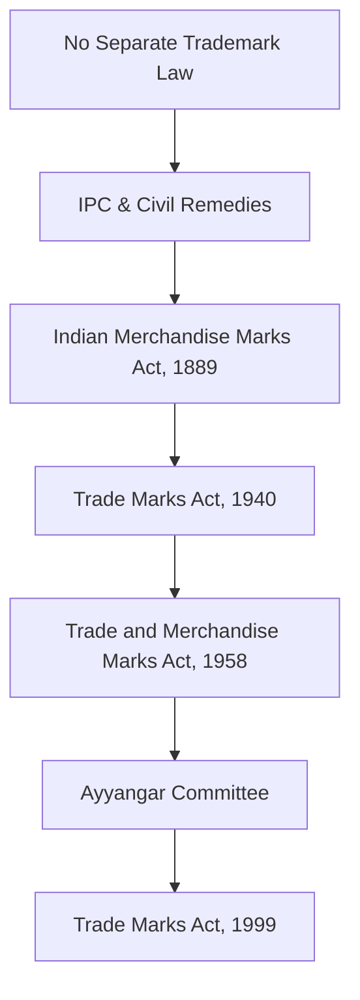

## Types of Trademarks

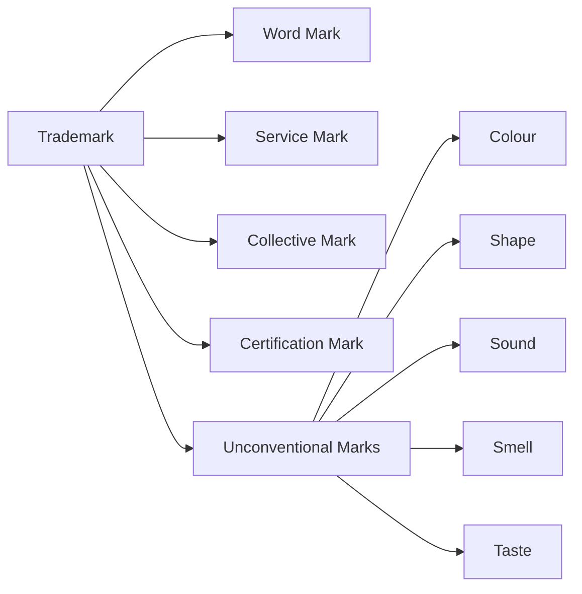

## Quick Revision

| Topic | Key Point |
|-------|-----------|
| Current Law | Trade Marks Act, 1999 |
| Duration | 10 years, renewable indefinitely |
| Section 2(1)(zb) | Definition of Trademark |
| Registration | Gives exclusive statutory rights |
| Word Mark | Protects words, letters, numerals |
| Service Mark | Identifies services |
| Collective Mark | Used by members of an association |
| Certification Mark | Indicates certified quality or standards |
| Unconventional Marks | Colour, Shape, Sound, Smell, Taste |
| Applicant | Proprietor using or proposing to use the mark |
| Filing Authority | CGPDTM |

---
# [[07 What Can Be Protected as a Trademark?]]

> [!SUMMARY]
> Not every sign can be registered as a trademark. To qualify for protection under the **Trade Marks Act, 1999**, the subject matter must satisfy the statutory definition of a trademark and meet certain legal requirements.

## Subject Matter of Protection

A mark can be protected only if it satisfies the definition of a **Trademark** under **Section 2(1)(zb)** of the Trade Marks Act, 1999.

To be registrable, **three essential conditions** must be fulfilled:

1. It must be a **sign (mark)**.
2. It must be **capable of graphical representation**.
3. It must be **capable of distinguishing** the goods or services of one person from those of others.

## 1. Sign or Mark

The concept of a **sign** is broad, but it is **not unlimited**.

The Act defines **"Mark"** to include:

- Device
- Brand
- Heading
- Label
- Ticket
- Name
- Signature
- Word
- Letter
- Numeral
- Shape of goods
- Packaging
- Combination of colours
- Any combination of the above

## Types of Marks

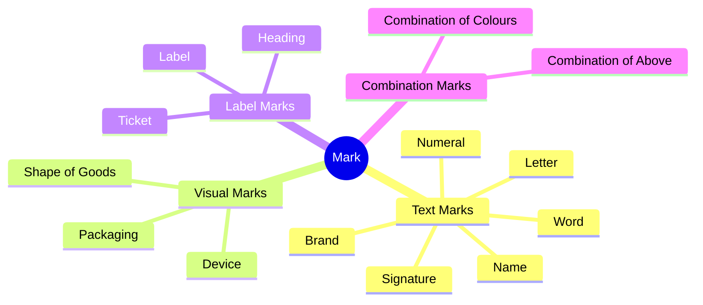

## Limitations on Registration of Shape Marks

A **shape mark** cannot be registered if:

- The shape results from the **nature of the goods themselves**.
- The shape is **necessary to obtain a technical result**.
- The shape gives **substantial value** to the goods.

> [!IMPORTANT]
> Trademark law protects **distinctiveness**, not functional product features.

## 2. Graphical Representation

A trademark must be capable of being represented graphically so that it can be entered in the Register of Trade Marks.

Examples:

| Type of Mark | Graphical Representation |
|--------------|-------------------------|
| Word Mark | Written in words or letters |
| Logo / Device Mark | Drawing or image |
| Shape Mark | Drawing or photographs |
| Colour Mark | Colour representation |
| Sound Mark | Musical notation or sound graph (where permitted) |

> [!NOTE]
> Even unconventional trademarks must generally be capable of graphical representation under Indian law.

## 3. Distinctive Character

A trademark must distinguish one trader's goods or services from those of others.

### Hierarchy of Distinctiveness

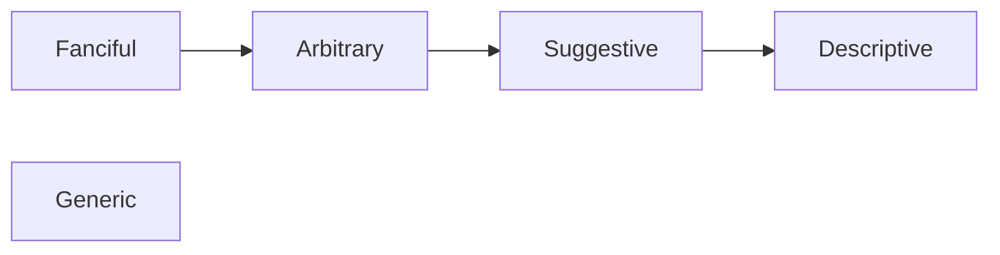

### Types of Distinctiveness

#### 1. Fanciful Marks (Strongest)

Completely invented words with no dictionary meaning.

**Example:** Google, Kodak

#### 2. Arbitrary Marks

Existing words used for unrelated goods or services.

**Example:** Apple for computers.

#### 3. Suggestive Marks

Suggest some quality or characteristic without directly describing it.

**Example:** Sugar Free for low-sugar products.

#### 4. Descriptive Marks

Directly describe:
- Quality
- Character
- Function
- Purpose
- Ingredients

These are generally **not registrable** unless they acquire distinctiveness.

#### 5. Generic Terms (Weakest)

Common names of products or services.

Examples:
- Milk
- Computer
- Soap

Generic terms **cannot** function as trademarks.

## Secondary Meaning (Acquired Distinctiveness)

A descriptive mark may become registrable if it acquires a **secondary meaning**.

This occurs when consumers recognize the mark **not merely as describing the product, but as identifying its commercial source**.

> [!IMPORTANT]
> The primary significance of the mark in the minds of consumers must be the **producer**, not the **product**.

**Example:**

"Holiday Inn" has acquired a secondary meaning because consumers associate it with a particular hotel chain rather than merely a place for holidays.

## What Cannot Be Registered as a Trademark?

The following marks are generally not registrable.

### 1. Functional Marks

Marks consisting of functional product features cannot be protected.
Trademark law does not grant exclusive rights over useful product designs.

### 2. Non-Distinctive Marks

Marks lacking distinctive character cannot be registered.

### 3. Immoral or Scandalous Matter

Marks containing immoral, obscene, or scandalous matter are prohibited.

### 4. Deceptive or Misdescriptive Marks

Marks that mislead consumers regarding:
- Nature
- Quality
- Origin
- Characteristics

are refused registration.

### 5. Conflicting Marks

Marks that are identical or deceptively similar to an existing registered trademark cannot normally be registered.

### 6. Fraudulent Marks

A person cannot knowingly make a false representation that a mark belongs to them or falsely claim ownership.

## Well-Known Trademark (Indian Law)

A **Well-Known Trademark** is a mark that has become widely recognized among a substantial segment of the public.

Because of its reputation, use of the same or a similar mark—even for **different goods or services**—may lead consumers to believe there is a connection with the well-known proprietor.

Indian law provides **enhanced protection** to well-known trademarks against dilution, unfair advantage, and misuse.

**Examples:**

- Google
- Tata
- Amul
- Infosys

## Conditions for Trademark Protection

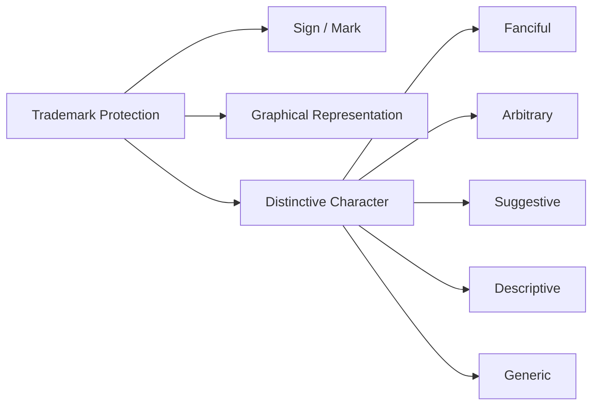

## Quick Revision

| Topic | Key Point |
|-------|-----------|
| Essential Conditions | Sign, Graphical Representation, Distinctiveness |
| Shape Marks | Cannot be functional or give substantial value |
| Strongest Marks | Fanciful and Arbitrary |
| Weakest Marks | Generic terms |
| Secondary Meaning | Descriptive mark acquires distinctiveness through use |
| Functional Marks | Not registrable |
| Deceptive Marks | Not registrable |
| Well-Known Trademark | Receives broader legal protection across different goods and services |

---
# [[08 Introduction to Copyright]]

> [!SUMMARY]
> **Copyright** is a legal right that protects the **original expression of ideas** in literary, artistic, musical, dramatic, cinematographic, and other creative works. It gives the creator exclusive rights to use, reproduce, distribute, and exploit the work for a limited period.

## Meaning of Copyright

The word **Copyright** literally means the **"right to copy."**

It refers to the exclusive legal right given to the creator or owner of a work to:
- Reproduce the work.
- Publish it.
- Sell copies.
- Distribute it.
- Communicate it to the public.
- Authorize others to use it.

> [!NOTE]
> Copyright protects the **expression of an idea**, not the idea itself.

## What is Copyright?

Copyright is:

> **The exclusive right granted by law, for a limited period, to the author or owner of an original work to reproduce, publish, distribute, communicate, or otherwise exploit that work.**

## Rights Granted Under Copyright

The copyright owner has the exclusive right to:
- Make copies of the work.
- Publish the work.
- Sell or distribute copies.
- Broadcast or communicate the work to the public.
- Translate the work.
- Adapt the work into another form.
- License or assign the rights.

## Commercial Exploitation

A copyright owner may commercially exploit the work by:
- Publishing books.
- Selling copies.
- Licensing the work.
- Granting permission to others.
- Broadcasting or streaming the work.

## Copyright Infringement

Copyright infringement occurs when a person uses a copyrighted work **without the permission** of the copyright owner and without any legal exception.

Examples:
- Copying an entire book.
- Uploading copyrighted movies illegally.
- Selling pirated software.
- Reproducing music without authorization.

### Remedies for Infringement

The copyright owner may seek:
- Injunction (court order to stop infringement).
- Damages or compensation.
- Delivery or seizure of infringing copies.

## Exceptions (Fair Dealing)

Certain limited uses of copyrighted works are permitted without permission.

Examples include:
- Research or private study.
- Education and teaching.
- Criticism or review.
- Reporting current events.
- Library lending.
- Quoting limited portions of a work.

> [!IMPORTANT]
> Fair dealing allows **limited and reasonable use**, not unrestricted copying.

## Original Works

Copyright protects **original works**.

Originality does **not** require:
- Novelty
- Uniqueness
- Exceptional artistic quality

A work is original if it:
- Originates from the author.
- Is created through the author's own skill, labour, and judgment.

> [!NOTE]
> The quality or merit of the work is **irrelevant** for copyright protection.

## Originality

Originality simply means that the work:
- Originated from the author.
- Is not copied from another work.

It is **not necessary** that the work be unique or highly creative.

## Derivative Works

Some works are created from existing works.
Examples include:
- Sound recordings.
- Films.
- Broadcasts.
- Adaptations.
- Translations.

These works may receive copyright protection even though they are derived from earlier works, provided the legal requirements are satisfied.

## Scope of Copyright

Copyright extends beyond merely making copies.

It also covers rights such as:
- Translation.
- Adaptation.
- Public performance.
- Communication to the public.
- Broadcasting.
- Digital reproduction.
- Distribution through modern technology.

## Copyright Protects Expression, Not Ideas

A fundamental principle of copyright law is:

> **Ideas are free. Their expression is protected.**

**Example:** Two photographers may independently take photographs of the moon.

Both photographs receive copyright because each is an independent expression, even though the underlying idea is the same.

## Overlapping Rights

Different creators may independently create similar works.

Each creator owns copyright in **their own original expression**.

**Example:**

Two artists independently paint the same landscape.

Each painting enjoys separate copyright protection.

## Ownership of Copyright

Generally, the **author** is the first owner of copyright.

However, ownership may belong to:

- Employer (in certain employment situations).
- Assignee.
- Successor in title.

Ownership may also be transferred through:

- Assignment.
- Licence.

## Moral Rights

Apart from economic rights, authors enjoy **Moral Rights**.

These include:

### Right of Attribution

The author has the right to be recognized as the creator of the work.

### Right of Integrity

The author may object to:
- Distortion.
- Mutilation.
- Modification.
- Derogatory treatment of the work that harms the author's reputation.

## Duration of Copyright

For most literary, dramatic, musical, and artistic works:

- **Life of the author + 60 years** (under Indian law).

Different rules apply to certain works such as:

- Cinematograph films.
- Sound recordings.
- Government works.
- Broadcasts.

## Copyright Does Not Depend On

Copyright protection does **not** depend upon:

- Artistic merit.
- Commercial value.
- Investment made.
- Popularity of the work.

Even simple works, such as:

- Bills
- Coupons
- Forms
- Simple drawings

may qualify for copyright if they satisfy the requirement of originality.

## Copyright at a Glance

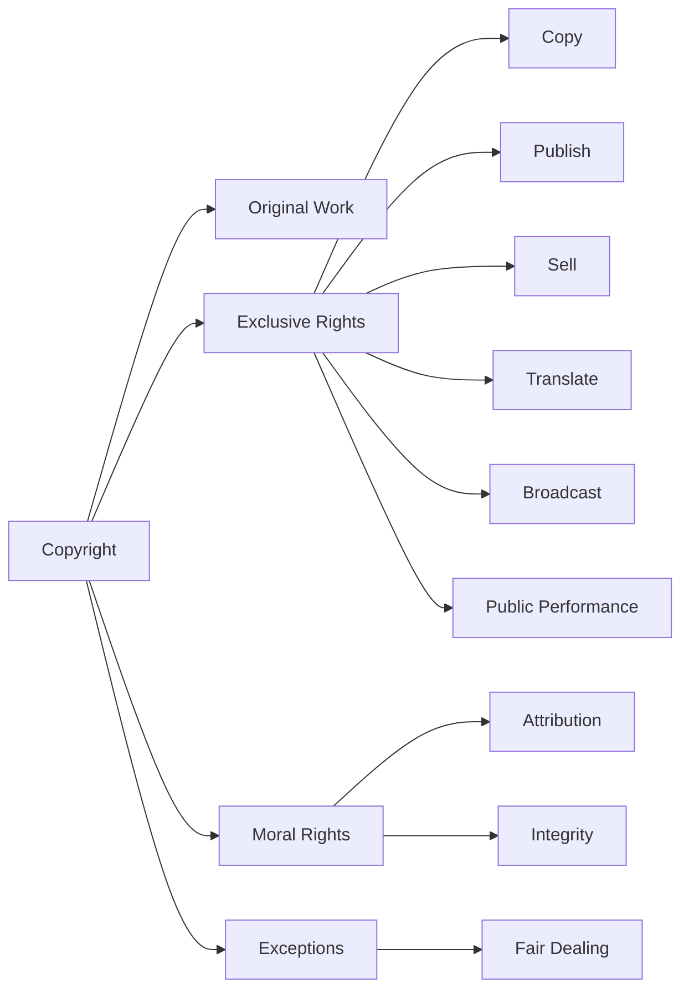

## Quick Revision

| Topic | Key Point |
|--------|-----------|
| Copyright | Exclusive right to protect original expression |
| Protects | Expression, not ideas |
| Originality | Must originate from the author; uniqueness not required |
| Rights | Copy, publish, sell, translate, perform, broadcast |
| Infringement | Unauthorized use of a copyrighted work |
| Fair Dealing | Limited use for education, research, criticism, etc. |
| Ownership | Usually the author; may pass to employer or assignee |
| Moral Rights | Attribution and Integrity |
| Duration | Life of the author + 60 years |
| Merit | Protection does not depend on artistic or commercial value |

---

# [[09 History and Origin of Copyright]]

> [!SUMMARY]
> Copyright evolved to protect authors and creators from unauthorized copying of their works. It encourages creativity, learning, and the dissemination of knowledge by granting creators exclusive rights for a limited period.

## Before Copyright Law

Before formal copyright laws existed:
- Authors had little legal protection.
- Others could freely copy and sell creative works.
- Printing technology made mass copying easy.
- Creators often received no economic benefit from their works.

## Plagiarism vs Piracy

### Plagiarism

**Plagiarism** is presenting another person's work or ideas as one's own.

Examples:

- Copying an essay and submitting it under your own name.
- Publishing another author's article without giving credit.

> [!NOTE]
> Plagiarism is mainly an ethical and academic issue, although it may also involve copyright infringement.

### Piracy

**Piracy** refers to the unauthorized reproduction, distribution, or sale of copyrighted works.

Examples:

- Selling pirated movies.
- Downloading copyrighted software illegally.
- Unauthorized distribution of music or books.

Piracy is a direct infringement of copyright.

## Early History

### Handwritten Manuscripts

Before the invention of printing:

- Religious and literary works were copied by hand.
- Books were often beautifully illustrated.
- Copying was slow and expensive.

## Invention of the Printing Press

Two major developments transformed publishing:

### Johannes Gutenberg

- Invented the **movable type printing press** (15th century).
- Enabled large-scale reproduction of books.

### William Caxton

- Introduced the **printing press in England**.
- Increased the availability of printed books.

The invention of printing created the need for copyright protection because books could now be copied rapidly.

## Early Printing Controls

Initially, governments were concerned more with **controlling publications** than protecting authors.

### Henry VIII

- Banned the import of certain foreign books into England.
- Exercised control over religious and political publications.

### Stationers' Company

The English Crown granted a charter to the **Stationers' Company**.

The Company received:

- Monopoly over printing.
- Exclusive right to print registered works.
- Power to search for and confiscate unauthorized books.

> [!IMPORTANT]
> These privileges primarily protected printers rather than authors.

## Statute of Anne, 1709

The **Statute of Anne** is regarded as the **first modern copyright law**.

Its objectives were:

- Encourage learning.
- Protect authors.
- Reduce piracy.

### Main Features

- Copyright belonged to the **author**, not merely the printer.
- Exclusive right to print and publish.
- Initial term of **14 years**.
- Renewable for another **14 years** if the author was still alive.

This law recognized copyright as a form of property.

## United States Copyright Act, 1790

The first copyright statute in the United States.

It provided protection for:

- Books
- Maps
- Charts

The Act was inspired by the principles of the Statute of Anne.

## Development During the 19th Century

Copyright protection gradually expanded to include:

- Paintings
- Drawings
- Musical works
- Dramatic works
- Sculptures
- Photographs

The law evolved from protecting only books to protecting a wide variety of creative works.

## Berne Convention, 1886

The **Berne Convention for the Protection of Literary and Artistic Works** is the most important international copyright treaty.

### Objectives

- Protect literary and artistic works internationally.
- Ensure authors receive protection in member countries.

### Important Principles

#### National Treatment

A foreign author receives the **same protection** as a country's own citizens.

#### Automatic Protection

Copyright exists automatically.

Registration is **not** required.

#### Minimum Duration

For most works:

- **Life of the author + 50 years** (minimum standard).

> [!NOTE]
> India provides **Life of the Author + 60 years**.

## Rome Convention, 1961

The Rome Convention introduced protection for **Neighbouring (Related) Rights**.

These rights protect:

- Performers
- Producers of phonograms
- Broadcasting organizations

Unlike copyright, neighbouring rights protect those who help communicate creative works to the public.

## TRIPS Agreement, 1994

The **Agreement on Trade-Related Aspects of Intellectual Property Rights (TRIPS)** established minimum international standards for intellectual property protection.

### Important Features

- Incorporates **Articles 1–21 of the Berne Convention** (except Moral Rights).
- Introduces the **Most-Favoured Nation (MFN) Principle**.
- Recognizes the **Idea–Expression Dichotomy**.
- Computer programs are protected as **literary works**.
- Copyright disputes may be resolved through the **WTO Dispute Settlement Body (DSB)**.

### Article 14 of TRIPS

Provides protection for:

- Performers
- Producers of phonograms
- Broadcasting organizations

## WIPO Copyright Treaty (WCT), 1996

The **WIPO Copyright Treaty (WCT)** supplements the Berne Convention to address digital technology and the internet.

### Subject Matter Protected

- Computer programs (as literary works).
- Databases and compilations involving intellectual creation.

### Rights Granted

Authors enjoy:

- Right of reproduction.
- Right of distribution.
- Right of rental.
- Right of communication to the public.

> [!IMPORTANT]
> The WCT modernized copyright law for the digital age.

## WIPO Performances and Phonograms Treaty (WPPT), 1996

The **WPPT** strengthens protection for performers and producers of sound recordings.

### Protected Persons

#### Performers

Examples:

- Actors
- Singers
- Musicians
- Dancers

#### Producers of Phonograms

Persons or organizations responsible for the first fixation of sounds.

### Rights Granted

- Right of reproduction.
- Right of distribution.
- Right of rental.
- Right of making available to the public.

## Evolution of Copyright

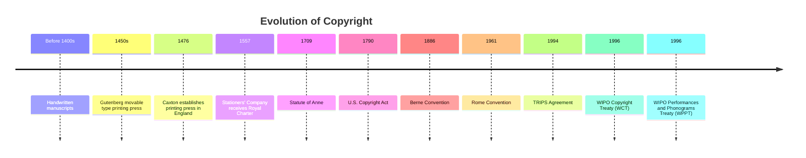

## International Copyright Framework

```C
    A[International Copyright]

    A --> B[Berne Convention 1886]
    A --> C[Rome Convention 1961]
    A --> D[TRIPS Agreement 1994]
    A --> E[WCT 1996]
    A --> F[WPPT 1996]

    B --> G[Automatic Protection]
    B --> H[National Treatment]

    C --> I[Neighbouring Rights]

    D --> J[Computer Programs]
    D --> K[Idea-Expression Principle]

    E --> L[Digital Copyright]
    E --> M[Databases]

    F --> N[Performers]
    F --> O[Phonogram Producers]
```

## Why Protect Copyright?

Copyright protection promotes the overall development of society.

### Economic Reasons
- Rewards creators for their work.
- Encourages investment in creative industries.
- Generates employment and economic growth.

### Social Reasons
- Encourages education and learning.
- Promotes cultural development.
- Preserves literature, music, films, and art.

### Technological Reasons
- Encourages innovation in digital media.
- Protects software and databases.
- Supports the digital economy.

## Quick Revision

| Topic | Key Point |
|--------|-----------|
| Plagiarism | Passing another's work as one's own |
| Piracy | Unauthorized copying or distribution of copyrighted works |
| Gutenberg | Invented movable type printing press |
| Stationers' Company | Monopoly over printing in England |
| Statute of Anne (1709) | First modern copyright law; 14 + 14 years |
| U.S. Copyright Act (1790) | First American copyright statute |
| Berne Convention (1886) | National Treatment, Automatic Protection, Life + 50 years |
| Rome Convention (1961) | Protection of neighbouring rights |
| TRIPS (1994) | Berne standards, MFN, computer programs, WTO enforcement |
| WCT (1996) | Digital copyright, computer programs, databases |
| WPPT (1996) | Rights of performers and phonogram producers |
| Rationale | Encourages creativity, economic growth, education, and technological development |

---
# [[ 10 Copyright in India]]

> [!SUMMARY]
> Copyright in India is governed by the **Copyright Act, 1957**, which protects original literary, dramatic, musical, artistic, cinematograph films, and sound recordings. The Act has been amended several times, with the **Copyright (Amendment) Act, 2012** being one of the most significant reforms.

## Evolution of Copyright Law in India

### Indian Copyright Act, 1914

- The first copyright legislation in India.
- Based on the **UK Copyright Act, 1911**.
- Provided legal protection to authors and publishers during the British period.

### Copyright Act, 1957

The **Copyright Act, 1957** replaced the 1914 Act.

Objectives:

- Provide a comprehensive copyright law for independent India.
- Protect the rights of authors and copyright owners.
- Encourage creativity and dissemination of knowledge.
- Bring Indian copyright law in line with international standards, particularly the **Berne Convention**.

> [!IMPORTANT]
> The **Copyright Act, 1957** is the principal legislation governing copyright in India.

### Copyright (Amendment) Act, 2012

The 2012 Amendment modernized Indian copyright law to address technological developments and international obligations.

### Major Features

- Balanced the rights of **authors**, **copyright owners**, and **users**.
- Strengthened the rights of **performers**.
- Improved access for persons with disabilities to copyrighted works.
- Introduced and expanded provisions relating to **compulsory licences**.
- Updated the law to better address the digital environment.

## Works Protected Under the Copyright Act

The Act protects the following categories of works:

### 1. Literary Works

### 2. Dramatic Works
### 3. Musical Works

Protection is given to the **musical composition** itself, not the sound recording.
### 4. Artistic Works

Examples:
- Paintings
- Drawings
- Sculptures
- Photographs
- Maps
- Architectural works
- Logos
### 5. Cinematograph Films
### 6. Sound Recordings
Examples:
- Songs
- Audio recordings
- Podcasts
- Recorded speeches

## Work of Joint Authorship

A **Work of Joint Authorship** is a work produced by **two or more authors** in which:

- The contribution of one author **cannot be distinguished** from that of the other author(s).

**Example:**

Two writers collaboratively write a novel where both contribute throughout the manuscript and their individual contributions cannot be separated.

## Who is the Author?

The Copyright Act identifies the author differently depending on the type of work.

| Type of Work | Author |
|--------------|--------|
| Literary Work | Author/Writer |
| Dramatic Work | Author/Playwright |
| Musical Work | Composer |
| Artistic Work | Artist |
| Photograph | Photographer |
| Cinematograph Film | Producer |
| Sound Recording | Producer |
| Computer Program | Programmer/Author |

> [!NOTE]
> For a **musical work**, the **composer** is the author—not the singer.
>
> For an **artistic work**, the **artist** who creates the work is the author.

## Copyright Protection in India

```C
    A[Copyright Act, 1957]

    A --> B[Literary Works]
    A --> C[Dramatic Works]
    A --> D[Musical Works]
    A --> E[Artistic Works]
    A --> F[Cinematograph Films]
    A --> G[Sound Recordings]
```

## Evolution of Copyright Law in India

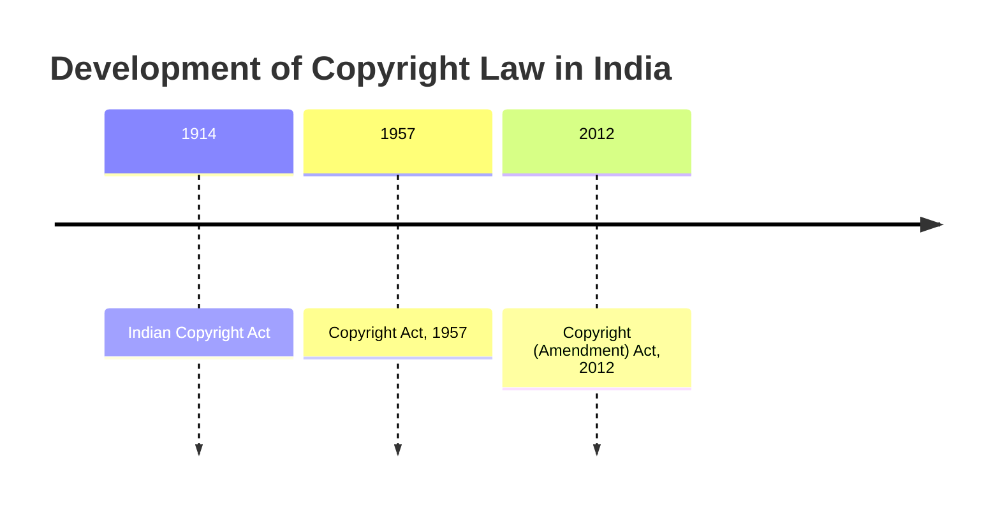

## Who is the Author?

| Type of Work | Author |
|--------------|--------|
| Literary Work | Author / Writer |
| Dramatic Work | Author / Playwright |
| Musical Work | Composer |
| Artistic Work | Artist |
| Photograph | Photographer (Person who takes the photograph) |
| Cinematograph Film | Producer |
| Sound Recording | Producer |
| Computer Program | Person who causes the computer program to be created (Programmer/Developer) |

> [!NOTE]
> - For a **Photograph**, the **photographer** (the person who takes the photograph) is the author.
> - For a **Cinematograph Film**, the **producer** is the author—not the director or actors.
> - For a **Sound Recording**, the **producer** is the author.
> - For a **Computer Program**, the author is the **person who causes the work to be created**, typically the programmer or software developer.
> - For a **Musical Work**, the **composer** is the author—not the singer.
> - For an **Artistic Work**, the **artist** is the author.
---

---
# [[11 Geographical Indications (GI)]]

> [!SUMMARY]
> A **Geographical Indication (GI)** is a sign used on goods that originate from a specific geographical area and possess qualities, reputation, or characteristics essentially attributable to that place of origin.

## What is a Geographical Indication?

A **Geographical Indication (GI)** identifies goods that:

- Originate from a particular geographical location.
- Possess specific qualities, characteristics, or reputation due to that origin.
- Have a clear link between the product and its place of production.

**Example:**

- Darjeeling Tea
- Kanchipuram Silk
- Mysore Sandal Soap

> [!IMPORTANT]
> A GI is **not limited to agricultural products**. It may also be granted to handicrafts, manufactured goods, and natural products.

## Essential Conditions for a GI

For a product to qualify as a Geographical Indication:

- It must originate from a specific geographical area.
- It must possess a particular **quality, characteristic, or reputation**.
- These qualities must be **essentially attributable to its geographical origin**.
- There must be a clear connection between the product and the place where it is produced.

## Why are Geographical Indications Protected?

GI protection aims to:

- Protect the traditional knowledge of local communities.
- Prevent misuse of famous geographical names.
- Promote fair competition.
- Increase market recognition.
- Encourage rural and regional development.
- Preserve cultural heritage.

## Geographical Indications of Goods (Registration and Protection) Act, 1999

India protects GIs through the:

**Geographical Indications of Goods (Registration and Protection) Act, 1999**

The Act provides:

- Registration of Geographical Indications.
- Legal protection against unauthorized use.
- Protection of producers and consumers.
- Recognition of genuine regional products.

## Registration

### Validity

- Registration is valid for **10 years**.
- It may be **renewed every 10 years**.

### GI Registry

The **Geographical Indications Registry** is located in:

**Chennai, Tamil Nadu**

## Registered Geographical Indications in India

| GI Product | Category | State |
|------------|----------|-------|
| Darjeeling Tea | Agricultural Product | West Bengal |
| Aranmula Kannadi | Handicraft | Kerala |
| Mysore Agarbathi | Manufactured Goods | Karnataka |
| Coimbatore Wet Grinder | Manufactured Goods | Tamil Nadu |
| Muga Silk | Handicraft / Textile | Assam |
| Odisha Pattachitra | Handicraft / Textile | Odisha |
| Nirmal Toys | Handicraft | Telangana |
| Banglar Rasogolla | Foodstuff | West Bengal |

## Requirements for GI Protection

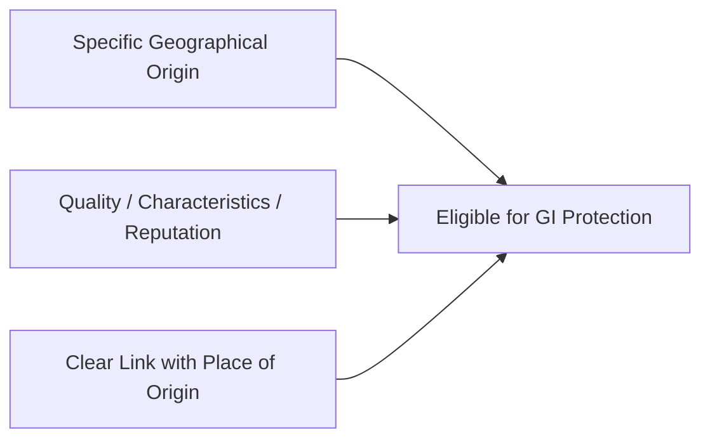

---

# [[12 Industrial Designs]]

> [!SUMMARY]
> An **Industrial Design** protects the **visual appearance** of an article, such as its shape, configuration, pattern, ornamentation, composition of lines or colours. It protects only the **non-functional aesthetic features** of a product.

## What is a Design?

Under the **Designs Act, 2000**, a design refers to the features of:
- Shape
- Configuration
- Pattern
- Ornamentation
- Composition of lines
- Composition of colours

These features must:

- Be applied to a finished article.
- Be capable of being made and sold separately.
- Appeal to the eye (visual appearance).
- Be **non-functional**.

> [!IMPORTANT]
> Design protection is granted only for the **appearance** of a product, **not its functional or technical features**.

## Who Grants Design Registration?

Design registration is granted by the **Design Wing of the Patent Office**.

### Headquarters
- Kolkata

### Branch Offices
- New Delhi
- Mumbai
- Chennai

## Who Can Apply?

The following persons may apply:

- Any person.
- Legal representative.
- Assignee.

> [!NOTE]
> The person who files the application becomes the **registered proprietor (owner)** of the design.

## Requirements for Registration

A design must satisfy the following conditions:

- Be **new or original**.
- Not have been disclosed to the public before filing.
- Be distinguishable from existing designs.
- Be applied to an article.
- Possess visual appeal.

## What Cannot Be Registered?

The following are **not registrable** as designs:

- Designs contrary to **public order or morality**.
- Articles not capable of being made and sold separately.
  - Example: Greeting postcards.
- Copyright-protected artistic works.
- Layout-designs of integrated circuits.
- Cartoons.
- Flags.
- Labels.
- National emblems or symbols.

## Duration of Protection

- Initial protection: **10 years**.
- Renewable for an additional **5 years**.

> **Maximum protection = 15 years.**

## Rights of the Registered Proprietor

Registration gives the proprietor the exclusive right to:

- Apply the registered design to the article.
- Manufacture articles using the design.
- Sell the article.
- Offer the article for sale.
- Import articles bearing the registered design.
- Prevent unauthorized use by others.

## Design Search

The Indian Patent Office provides an online **Design Search** facility to check existing registered designs before filing.

## Locarno Classification

India follows the **Locarno Agreement** for the international classification of industrial designs.

Examples:

| Class | Category |
|--------|----------|
| Class 2 | Articles of Clothing |
| Class 28 | Pharmaceutical and Cosmetic Products |
| Class 99 | Miscellaneous Articles |

## Design Registration Process


## What is Protected?

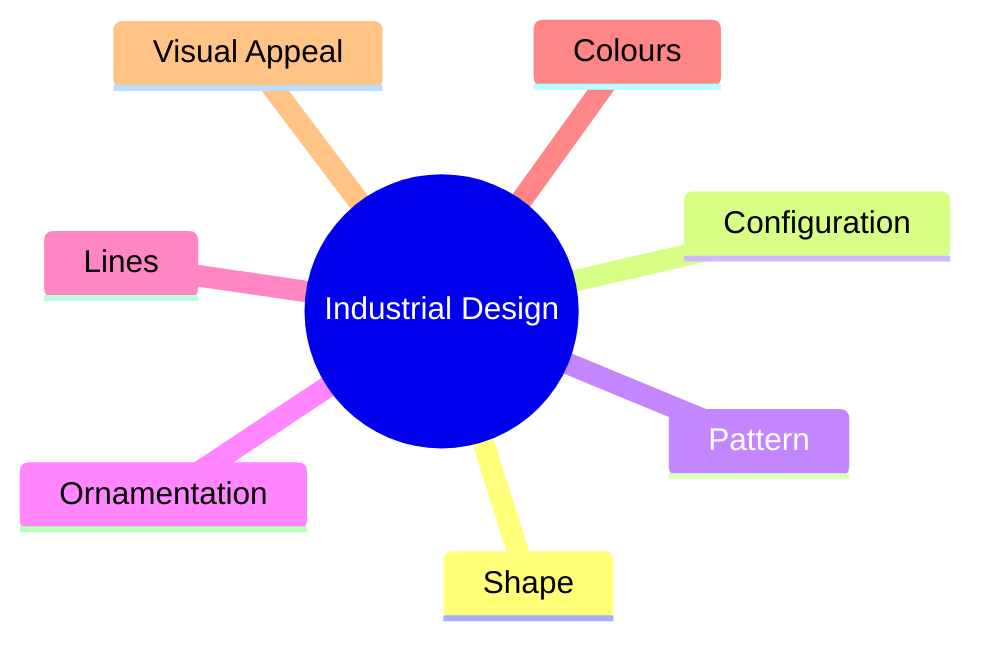

## Design Infringement

Design infringement occurs when a person, without permission:

- Applies the registered design to an article.
- Manufactures articles using the registered design.
- Imports infringing articles.
- Sells or offers for sale infringing articles.

## Remedies for Infringement

The registered proprietor may seek:

- Injunction.
- Recovery of damages.
- Statutory compensation.

> [!NOTE]
> The Designs Act provides statutory damages (commonly examined as **₹25,000 per contravention**, subject to an overall limit prescribed under the Act, often cited as **₹50,000 per design** in exam notes).

## Cancellation of Registration

Even after registration, a design may be cancelled on various grounds, including:

- The design is **not new or original**.
- It was previously published in India or elsewhere.
- It is not registrable under the Designs Act.
- It does not satisfy the statutory definition of a design.

## Quick Revision

| Topic | Key Point |
|--------|-----------|
| Governing Law | Designs Act, 2000 |
| Protects | Visual appearance of an article |
| Includes | Shape, Configuration, Pattern, Ornamentation, Lines, Colours |
| Does Not Protect | Functional or technical features |
| Filing Office | Design Wing, Patent Office |
| Headquarters | Kolkata |
| Branch Offices | New Delhi, Mumbai, Chennai |
| Who Can Apply | Any person, legal representative, assignee |
| Requirements | New, original, undisclosed, distinguishable, applied to an article, visually appealing |
| Initial Term | 10 years |
| Renewal | Additional 5 years |
| Maximum Protection | 15 years |
| Classification | Locarno Classification |
| Example Classes | Class 2 – Clothing, Class 28 – Pharmaceuticals & Cosmetics, Class 99 – Miscellaneous |
| Remedies | Injunction, damages, statutory compensation |
| Cancellation | Possible even after registration on statutory grounds |

