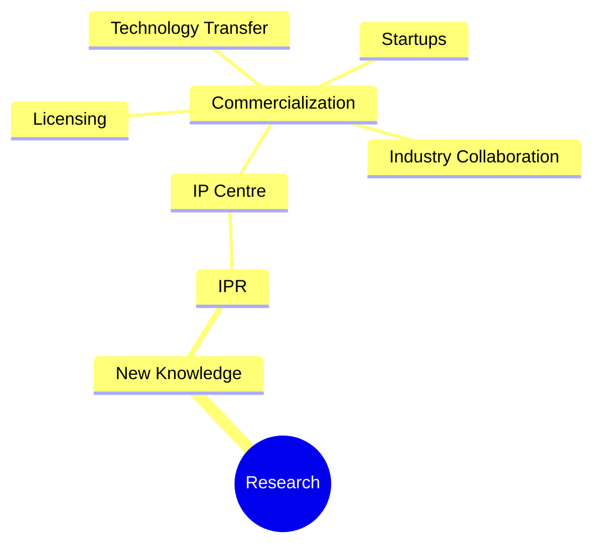
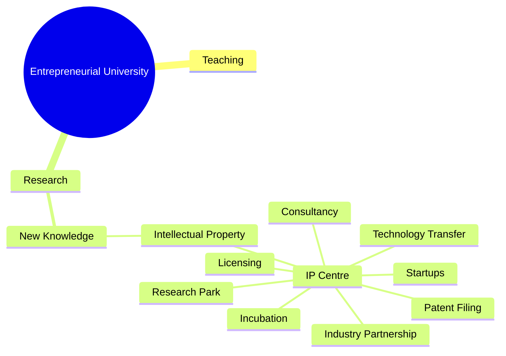
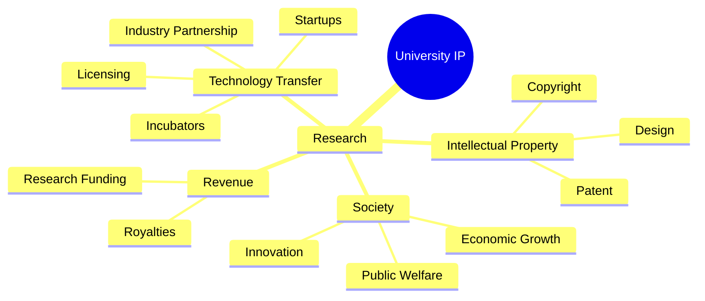
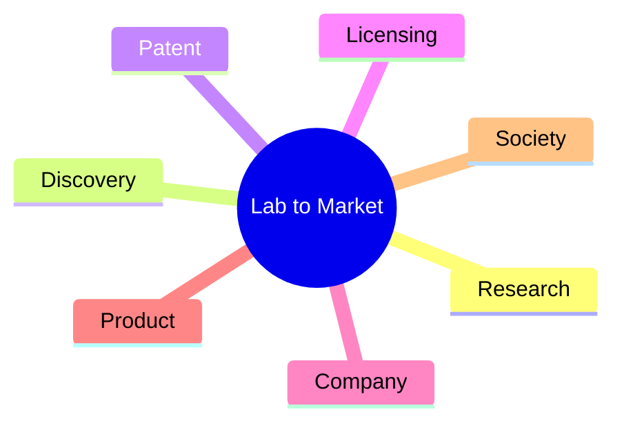
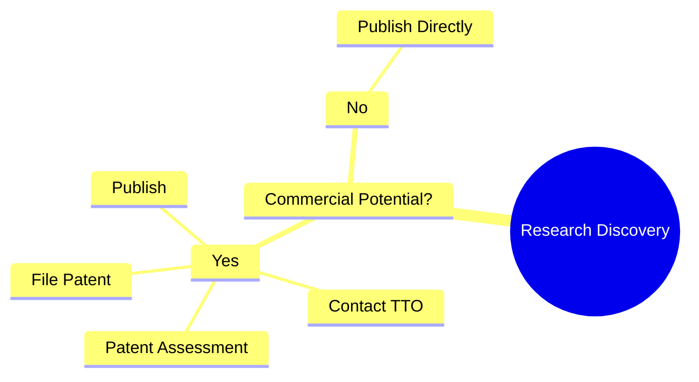
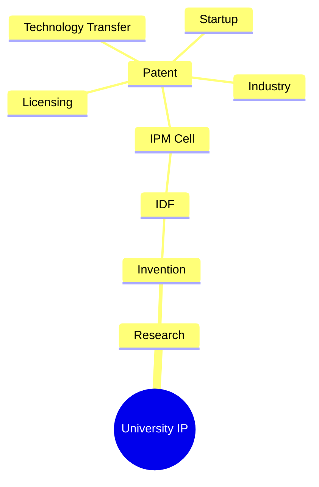
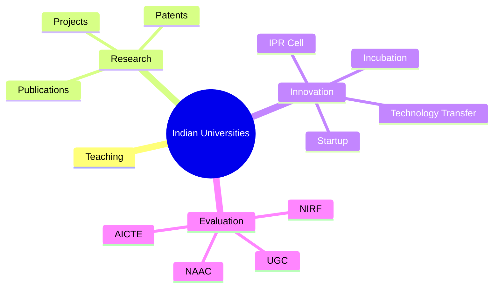
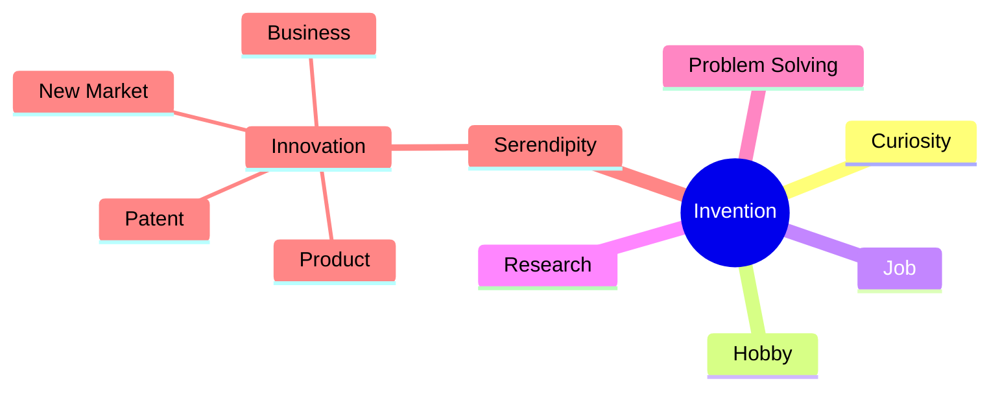

# [[01 The Enterpreneurial University]]

> [!SUMMARY]
> An **Entrepreneurial University** is a university that not only **teaches** and **conducts research** but also **protects, manages, and commercializes intellectual property (IP)** generated through research. It transforms research into products, services, startups, and technologies that benefit society and the economy.

## Evolution of the University

Traditionally, universities had two core functions:

### Traditional Functions
- Teaching
- Research

### Modern Function

- Entrepreneurship (Innovation & Commercialization)

## Functions of a University

### 1. Teaching Function

The primary objective is the **dissemination of knowledge**.

Activities include:

- Classroom teaching
- Training students
- Skill development
- Capacity building

> [!NOTE]
> Institutions such as **IITs** are established not only to impart education but also to advance research and innovation.

### 2. Research Function
Research aims at the **creation of new knowledge**.

Research may result in:

- New technologies
- New products
- New services
- Scientific discoveries
- Innovative processes

## 3. Entrepreneurial Function
The entrepreneurial function connects **research with industry and society**.

Instead of allowing research to remain inside laboratories, universities:

- Protect Intellectual Property.
- Transfer technology.
- License inventions.
- Incubate startups.
- Create economic and social value.

## From Research to Commercialization



## Commercialization of Research

Commercialization means converting research into products or services that can be used by society.

Methods include:
- Licensing patents.
- Technology transfer.
- Collaborative research with industry.
- Startup creation.
- Consultancy.
- Product development.

## Technology Transfer

Technology Transfer is the process of moving research outcomes from universities to industry for commercial use.

### Example

A university develops a new battery technology.

Instead of manufacturing batteries itself, the university licenses the technology to a battery company.

The company manufactures the product and pays royalties to the university.

Both society and the university benefit.

## Why Commercialize University Research?

Commercialization helps universities by:

- Generating revenue.
- Funding future research.
- Encouraging innovation.
- Building an entrepreneurial culture.
- Solving real-world problems.
- Promoting social welfare.

## Objectives of an Entrepreneurial University

- Encourage research and innovation.
- Generate funding for future research.
- Promote collaboration with industry.
- Convert knowledge into wealth.
- Support economic development.
- Improve public welfare.

## Government Funding for Scientific Research (USA)

The United States heavily funds scientific research through government agencies.

### National Science Foundation (NSF)

Supports:

- Basic scientific research.
- University research.
- Engineering.
- Technology.

### National Institutes of Health (NIH)

Supports:

- Medical research.
- Biomedical sciences.
- Healthcare innovation.

## U.S. Innovation Model

The basic idea is:

Government funds research →

New discoveries →

New technologies →

New industries →

New jobs →

Economic growth →

Global competitiveness

```python
A[Government Funding]
-->B[University Research]
-->C[New Technology]
-->D[New Industries]
-->E[Employment]
-->F[Economic Growth]
-->G[National Competitiveness]
```

## Ownership of IPR in the United States

### Before 1980

- Patents arising from federally funded research generally belonged to the **Government**.
- Universities had limited control over commercialization.

### Bayh–Dole Act, 1980

The **Bayh–Dole Act** transformed university innovation.

Universities receiving federal funding could:

- Own patents arising from federally funded research.
- License technologies to industry.
- Establish Technology Transfer Offices (TTOs).
- Share royalty income with inventors.

As a result:

- Universities created their own IP policies.
- Technology commercialization increased significantly.
- University startups expanded rapidly.

## The Entrepreneurial State

The concept of the **Entrepreneurial State** suggests that governments should actively support innovation.

The State should:

- Invest in high-risk research.
- Support long-term innovation.
- Encourage emerging technologies.
- Create an ecosystem for entrepreneurship.

However,

> [!IMPORTANT]
> When the government assumes significant financial risk, it should also receive an appropriate share of the rewards so that public investment benefits society.

This creates a **Risk–Reward Relationship**.

Government investment → Innovation → Economic returns → Funding for future innovation

## Public vs Private Sector

| Public Sector | Private Sector |
|---------------|----------------|
| Research funding | Investment in commercialization |
| Grants | Venture Capital |
| Subsidies | Business expansion |
| Tax incentives | Market risk |
| Technical standards | Product development |

## Role of the IP Centre

An **IP Centre** acts as the bridge between researchers and industry.

### Functions
- Identify Intellectual Property.
- Screen inventions for patentability.
- Manage IP portfolios.
- File patent applications.
- Register other IP rights.
- Maintain renewals.
- Enforce IP rights.
- License technology.
- Facilitate commercialization.

## Industry Partnership (Push–Pull Model)

Industry and universities work together through a **two-way relationship**.

### Push
The **University pushes innovation** towards industry.

Examples:

- Patents
- Research publications
- New technologies
- Skilled graduates

### Pull
**Industry pulls innovation** by expressing its needs.

Examples:

- Identifying real-world problems.
- Funding university research.
- Seeking technological solutions.
- Collaborating on product development.

> [!TIP]
> **Push = University offers innovation.**
>
> **Pull = Industry demands innovation.**
>
> Together they accelerate technology transfer and commercialization.

## Consultancy

Universities also provide consultancy services.

Faculty members assist industry by:
- Solving technical problems.
- Providing expert advice.
- Conducting specialized research.
- Testing and validating products.

Consultancy strengthens university–industry collaboration.

## Incubating Startups

Universities encourage entrepreneurship through incubation centres.

Support provided includes:
- Business counselling.
- Legal assistance.
- Intellectual Property guidance.
- Business plan development.
- Funding support.
- Mentorship.
- Networking with investors.

Some universities:
- Own part of the startup's equity.
- License university-owned IP to startups.

## Research Parks and Incubators

### Research Park

A research park is a cluster where:
- Universities
- Startups
- Industries
- Research laboratories

work together to develop new technologies.

### Business Incubator

An incubator helps early-stage startups by providing:

- Office space.
- Infrastructure.
- Mentors.
- Funding opportunities.
- Technical support.
- Legal and IP assistance.

## Entrepreneurial University Ecosystem



## Quick Revision

| Topic | Key Point |
|--------|-----------|
| Traditional University | Teaching + Research |
| Entrepreneurial University | Teaching + Research + Commercialization |
| Research Output | New knowledge, products, services, technology |
| Commercialization | Licensing, technology transfer, startups |
| Technology Transfer | Moving university research to industry |
| Bayh–Dole Act, 1980 | Universities can own and commercialize federally funded inventions |
| NSF | Funds scientific and engineering research |
| NIH | Funds medical and biomedical research |
| Entrepreneurial State | Government invests in high-risk innovation and shares in rewards |
| Push–Pull Model | University pushes innovation; industry pulls solutions |
| IP Centre | Protects, manages, licenses, and commercializes IP |
| Incubator | Supports startup creation and growth |
| Research Park | Collaboration among universities, startups, and industry |

---
# [[02 Universities and Intellectual Property (IP)]]

> [!SUMMARY]
> Intellectual Property (IP) is a key asset of modern universities. It enables universities to **protect research**, **license inventions**, **generate revenue**, **create startups**, and **transfer technology** for the benefit of society.

## Importance of IP for Universities

In the modern knowledge economy, IP is the foundation of an **entrepreneurial university**.

IP enables universities to:

- Protect research outcomes.
- Commercialize inventions.
- Generate licensing revenue.
- Encourage innovation.
- Promote industry collaboration.
- Support startups and entrepreneurship.
- Benefit society through technology transfer.

> [!IMPORTANT]
> Research creates **knowledge**; IP protects that knowledge; commercialization converts it into **economic and social value**.

## IP as the Foundation of the New University

The modern university is no longer just a centre for teaching and research.

It is also a:

- Technology creator.
- Innovation hub.
- Startup ecosystem.
- Industry partner.
- Economic development engine.

## Bayh–Dole Act (United States)

The **Bayh–Dole Act, 1980** transformed university innovation in the United States.

It allows universities receiving federal research funding to:

- Own patents arising from funded research.
- License inventions to industry.
- Earn royalty income.
- Share royalties with inventors.

This greatly increased technology transfer and university entrepreneurship.

## PUPFIP Bill (India)

**PUPFIP** stands for:

**Protection and Utilization of Public Funded Intellectual Property Bill**

### Objective

- Allow publicly funded institutions to own and commercialize IP.
- Promote technology transfer.
- Encourage commercialization of publicly funded research.

> [!NOTE]
> The PUPFIP Bill was **not enacted** and therefore never became law in India.

## Licensing of Patents

Instead of manufacturing products themselves, universities often **license patents** to companies.

The company:

- Manufactures the product.
- Pays royalties to the university.

Benefits include:

- Revenue for universities.
- Funding for future research.
- Rewards for inventors.
- Faster commercialization.

## The New University Model

The modern university focuses on:

- Research.
- Intellectual Property.
- Technology transfer.
- Entrepreneurship.
- Startup incubation.
- Public welfare.

Research →IP → Commercialization → Economic Growth → Social Benefit

## IP as a Tool for Innovation

IP encourages:

- Development of new technologies.
- Creation of new products.
- Commercialization of research.
- Dissemination of innovation.

By protecting inventions, universities attract:

- Investors.
- Industrial partners.
- Entrepreneurs.

## Technology Transfer

Technology Transfer means moving university research from the laboratory to society.

It ensures research is:

- Commercialized.
- Manufactured.
- Used by the public.

### Impact

Since the **Bayh–Dole Act (1980)**:

- More than **5,000 startups** have been created based on university technologies in the United States.

Similarly, many **IITs** have established:

- Startup incubators.
- Innovation centres.
- Technology parks.
- Industry collaborations.

## Why is IP Important for Universities?

IP helps universities:

- Protect inventions.
- Generate licensing income.
- Encourage research.
- Promote entrepreneurship.
- Attract industry partnerships.
- Create startups.
- Benefit society through innovation.

## Success Stories

### Florida State University – Taxol

**Technology:**
- Taxol (Cancer drug)

**Industrial Partner:**
- Bristol-Myers Squibb

**Outcome:**
- Earned approximately **US \$45 million** in licensing revenue.

### University of Minnesota – Abacavir

The university licensed technology relating to **Abacavir**, an HIV medicine.

**Outcome:**
- Generated more than **US \$370 million** in revenue.

> [!TIP]
> These examples demonstrate how successful licensing can finance future university research.

## Billions at Stake: University Patent Disputes

### Madey v. Duke University (2002)

This landmark U.S. case clarified that:
- Universities cannot freely use patented inventions merely because the use is for research.
- The experimental use exception is very limited.

The case emphasized the commercial importance of university patents.

### CRISPR–Cas9 Patent Dispute

CRISPR–Cas9 is a revolutionary **gene-editing technology**.

The major dispute involved:
- University of California, Berkeley (UCB)
- Broad Institute (MIT & Harvard)

Timeline:
- **2012:** UCB filed the patent application first.
- **2014:** Broad Institute obtained the first granted patent for certain CRISPR applications.

The dispute involved ownership of valuable biotechnology patents worth billions of dollars.

> [!IMPORTANT]
> The CRISPR dispute illustrates how valuable university-generated IP can become.

## From Laboratory to Market

Many university researchers have founded globally successful companies.

### Herbert Boyer
- University of California scientist.
- Co-founded **Genentech**.
- Developed recombinant DNA technology.
- Produced synthetic human insulin (1978).
- Genentech was acquired by **Roche** in 2009.

### Dr. P. Venkat Rangan
- Indian-American computer scientist.
- Founded **Yodlee Inc.**
- Demonstrates how university research can lead to successful technology companies.

## Medical Research Council (MRC) Laboratory of Molecular Biology

The **MRC Laboratory of Molecular Biology (LMB)** is one of the world's leading research institutions.

Achievements:
- Associated with numerous Nobel Prize winners.
- Generated significant licensing income.

### Example
The laboratory licensed intellectual property relating to **Humira**, generating approximately **US \$700 million** in royalty income.

## University Innovation Ecosystem



## Lab to Market Journey



## Quick Revision

| Topic | Key Point |
|--------|-----------|
| Importance of IP | Protects research and enables commercialization |
| Bayh–Dole Act (1980) | Universities can own and license federally funded inventions |
| PUPFIP Bill | Proposed Indian law for publicly funded IP; not enacted |
| Licensing | Generates royalty income and funds future research |
| Technology Transfer | Moves research from laboratory to industry and society |
| Startup Ecosystem | Universities incubate startups and promote entrepreneurship |
| Florida State University | Taxol licensing earned about US \$45 million |
| University of Minnesota | Abacavir licensing generated over US \$370 million |
| Madey v. Duke (2002) | Limited research exemption for patent use |
| CRISPR–Cas9 | Major patent dispute between UCB and Broad Institute |
| Herbert Boyer | Co-founded Genentech from university research |
| MRC LMB | Earned about US \$700 million from Humira licensing |

---
# [[03 Publish or Patent?]]

> [!SUMMARY]
> Researchers often face a critical decision: **Should they publish their research first or file a patent first?** Since patent law requires **novelty**, publishing before filing can destroy patent rights. Therefore, universities usually follow the principle: **Patent first, publish later.**

## The Dilemma

Researchers generally have two options:

- Publish the research in journals.
- File a patent application.

The decision affects:

- Patentability.
- Commercialization.
- Academic recognition.
- Revenue generation.

> [!IMPORTANT]
> **Golden Rule:** **Patent First → Publish Later**

## Real-Life Example: Rob Pereneczky

**Rob Pereneczky**, a professor at **Imperial College London**, developed a novel protein.

What happened?

- He approached the university's **Technology Transfer Office (TTO)** to commercialize the discovery.
- The TTO showed little interest in patenting.
- Meanwhile, he had already written and published a research paper.
- The invention entered the **public domain**.

### Consequence

Because the invention was already publicly disclosed:

- Novelty was lost.
- Obtaining a patent became difficult or impossible in many countries.
- Commercial opportunities were greatly reduced.

> [!NOTE]
> Once information enters the **public domain**, anyone can read and use it unless protected by IP.

## Why Can Publication Be a Problem?

Publishing before filing a patent may:

- Destroy novelty.
- Prevent patent protection in many countries.
- Reduce commercial value.
- Allow competitors to build upon the invention.
- Make technology transfer difficult.

## What is Novelty?

Novelty means that an invention:

- Has never been publicly disclosed.
- Is new anywhere in the world before the patent filing date.

Public disclosure includes:

- Journal publications.
- Conference presentations.
- Thesis publications.
- Websites.
- Public demonstrations.

> [!IMPORTANT]
> If novelty is lost, patent protection is generally lost.

## Grace Period

Some countries provide a **grace period**, allowing inventors to file a patent after their own disclosure.

### India

Under certain circumstances, the **Patents Act, 1970** provides a **12-month grace period** for specific disclosures.

This is an **exception**, not the general rule.

Researchers should **not rely on the grace period** unless the disclosure clearly satisfies the legal requirements.

## Section 31 – Patents Act, 1970

Section 31 provides protection where:

- The invention is described in a paper.
- The paper is read before a learned society or published with the inventor's consent.
- The patent application is filed by the **true and first inventor** (or a person deriving title from them).
- The application is filed **within 12 months** of that publication or presentation.

> [!TIP]
> **Remember:** Section 31 does **not** permit unlimited delay—it only provides limited protection in specified situations.

## Strategies to Protect Patent Rights

Before publicly disclosing research, universities generally adopt the following strategies:

### 1. File a Provisional Patent Application

A provisional application secures an **early filing date** while allowing further development of the invention.

### 2. Use Non-Disclosure Agreements (NDAs)

Before discussing the invention with:

- Companies
- Investors
- Collaborators

use an **NDA** to maintain confidentiality.

### 3. Contact the Technology Transfer Office (TTO)

Researchers should consult the university's:

- IP Cell
- TTO
- Innovation Office

before publishing or presenting research.

### 4. Strategic Disclosure

If disclosure cannot be avoided:

- Reveal the **results**.
- Avoid revealing the **complete technical implementation**.

This reduces the risk of competitors copying the invention.

## Why Do Researchers Publish Early?

Researchers are often evaluated based on:

- Publications.
- Citations.
- Promotions.
- Research grants.
- Academic reputation.

This creates pressure to publish quickly.

> [!NOTE]
> Universities must balance **academic publication** with **IP protection**.

## Commercialization Considerations

Before deciding whether to patent, researchers should evaluate:

- Commercial potential.
- Market demand.
- Cost of patent protection.
- Licensing opportunities.
- Time required for commercialization.
- Long-term impact.

Not every invention should necessarily be patented.

## Reality of University Patents

> [!IMPORTANT]
> Research shows:

- Most patents **do not generate significant revenue**.
- The average patent often earns **less than the total cost** of obtaining and maintaining it.
- Only about **10% of university patents** become commercially successful.

Therefore, universities should patent inventions **strategically**, not automatically.

## Decision Framework



## Publication vs Patent

| Publication | Patent |
|-------------|---------|
| Shares knowledge | Protects knowledge |
| Builds academic reputation | Creates commercial value |
| May destroy novelty | Requires novelty |
| Public domain | Exclusive rights |
| Supports scientific progress | Supports technology commercialization |

## Best Practices for Researchers

- Evaluate commercial potential early.
- Consult the university's IP Cell or TTO.
- File a provisional patent before disclosure when appropriate.
- Use NDAs during industry discussions.
- Avoid unnecessary public disclosure.
- Publish after securing patent rights whenever possible.

## Quick Revision

| Topic | Key Point |
|--------|-----------|
| Golden Rule | Patent first, publish later |
| Novelty | Public disclosure destroys novelty |
| Public Domain | Information becomes freely accessible |
| Grace Period (India) | Limited 12-month protection under specific conditions |
| Section 31 | Protects certain disclosures before learned societies if patent is filed within 12 months |
| TTO | Advises on IP protection and commercialization |
| NDA | Maintains confidentiality before disclosure |
| Provisional Patent | Secures an early filing date |
| Reality | Most patents are not commercially successful; only ~10% generate significant returns |

---

# [[04 Managing Intellectual Property (IP) at Universities]]

> [!SUMMARY]
> An **IP Management (IPM) Cell** (also known as a **Technology Transfer Office (TTO)**) is responsible for identifying, protecting, managing, commercializing, and maintaining the Intellectual Property (IP) generated by a university.

## Intellectual Property Generated by Universities

Universities create several forms of IP through research, innovation, teaching, and creative activities.

| Type of IP | Example |
|------------|---------|
| Patent | New invention, process, machine |
| Trademark | University logo, startup brand |
| Copyright | Software, books, lecture notes, research papers |
| Industrial Design | Product appearance, shape, pattern |
| Semiconductor Topography | IC Layout Designs |
| Plant Variety Protection | New plant varieties |
| Geographical Indication (GI) | Regional products (where applicable) |
| Trade Secret | Formula, algorithm, manufacturing process, know-how |

> [!IMPORTANT]
> Most IP laws recognize **human inventors/authors**. Computers and AI may assist in creation, but they generally cannot independently own IP rights.

## What is an IPM Cell?

An **IP Management Cell (IPM Cell)** is a specialized university office responsible for managing the complete lifecycle of Intellectual Property.

It may also be called:

- Technology Transfer Office (TTO)
- Technology Licensing Office (TLO)
- Technology Commercialization Office (TCO)

## Establishment of an IPM Cell

An institution may establish an IPM Cell:

- On its own initiative.
- Due to Government policy or mandate.
- To encourage innovation and commercialization.

### Composition

The committee generally consists of:

- Head (Senior Professor / Dean Research / Director Innovation)
- 3–8 members including:
  - Faculty representatives
  - Legal/IP experts
  - Industry experts
  - Research administration
  - Finance representative

The committee functions according to the University's **IP Policy**.
![[Pasted image 20260726200452.png]]
## Core Functions of an IPM Cell

### Education & Awareness

- Conduct IPR awareness programmes.
- Organize lectures and workshops.
- Train faculty, researchers, and students.
- Promote innovation and entrepreneurship.
- Encourage patent filing.

### Identification of IP

Identify IP generated through:

- Faculty research
- Student projects
- Consultancy
- Sponsored research
- Startups
- Collaborative projects

### Protection of IP

- Patent filing
- Trademark registration
- Copyright registration
- Design registration
- Trade secret management

### Commercialization

- Licensing
- Technology transfer
- Startup incubation
- Consultancy
- Industry collaboration

### Administration

- Maintain IP records.
- Monitor renewal deadlines.
- Pay statutory fees.
- Track patent prosecution.
- Maintain licensing records.
- File statutory compliances (e.g., Form 27).

## Patent Management Workflow

> [!IMPORTANT]
> Patent management is a collaborative process involving **three stakeholders**:
>
> **Institution / Inventor → IPM Cell (TTO) → Patent Attorney / IP Firm**

| Stage | Institution / Inventor | IPM Cell (University / TTO) | Patent Attorney / IP Firm |
|------|-------------------------|-----------------------------|---------------------------|
| **1** | Conduct research and generate invention | Receive Invention Disclosure Form (IDF) | — |
| **2** | Submit IDF with technical details | Register and validate the disclosure | — |
| **3** | Provide novelty, funding details, inventors' contribution, prototype information | Perform preliminary scrutiny | — |
| **4** | Explain invention whenever required | Conduct preliminary novelty assessment and prior-art search | Assist with detailed prior-art search if required |
| **5** | Discuss commercial potential | Decide whether to patent, publish, or keep as a trade secret | Provide legal opinion on patentability |
| **6** | Approve filing | Obtain institutional approval and filing budget | Draft patent specification and drawings |
| **7** | Review patent draft | Coordinate filing process | File patent application |
| **8** | Provide technical clarification | Monitor examination process | Respond to First Examination Report (FER) and prosecute patent |
| **9** | Assist in prototype development/testing | Coordinate with inventors and attorney | Continue prosecution until grant |
| **10** | Support commercialization | Licensing, technology transfer, startup support, industry marketing | Draft licensing and legal agreements where required |
| **11** | Continue technical support | Maintain records, renew patents, pay maintenance fees, Form 27 compliance | Handle foreign filings, enforcement, and legal advisory |

## Prior Art Search

The IPM Cell performs prior-art searches to determine whether the invention is novel.

### Free Databases
- Google Patents
- Google Scholar
- Espacenet
- The Lens
### Paid Databases
- Orbit Intelligence
- Derwent Innovation
- PatSnap
### Technical Literature
- IEEE Xplore
- Scopus
- ScienceDirect

> [!TIP]
> Inventors should perform an initial literature and patent search before formally submitting an invention.

## Important Documents

### Invention Disclosure Form (IDF)
The **IDF** is the first document submitted to the IPM Cell.

It generally contains:

- Title of invention
- Technical description
- Novel features
- Inventor details
- Inventor contribution ratio
- Funding source
- Prototype status
- Commercial applications
- External collaborators
- Previous publications (if any)

### Non-Disclosure Agreement (NDA)

Used when confidential information is shared with:
- Companies
- Investors
- Consultants
- Collaborators

The NDA preserves confidentiality until appropriate IP protection is secured.

## Staffing of an IPM Cell

| Level | Position | Responsibilities |
|------|-----------|------------------|
| **Level 1** | Head / Director | Overall administration, policy implementation, strategic planning, industry collaboration |
| **Level 2** | IP Officer | Prior-art search, patent analytics, inventor coordination, patent processing |
| **Level 3** | Legal & Licensing Team | Patent drafting coordination, licensing, technology transfer, NDAs, royalty management |
| **Level 4** | Technical & Database Staff | Patent database management, record keeping, analytics, reporting, portfolio monitoring |

> [!NOTE]
> Large universities handling **hundreds of patent applications** generally maintain dedicated IP professionals, patent analysts, and specialized database systems.

## Innovation Lifecycle



## Key Contributions of an IPM Cell
- Protect university-generated innovations.
- Prevent loss of valuable IP.
- Increase commercialization opportunities.
- Build industry partnerships.
- Generate licensing revenue.
- Encourage entrepreneurship.
- Promote startup incubation.
- Strengthen the university's innovation ecosystem.

## Quick Revision

| Topic | Key Point |
|--------|-----------|
| IPM Cell | Manages the complete IP lifecycle in a university |
| Other Names | TTO, TLO, Technology Commercialization Office |
| Main Functions | Awareness, Identification, Protection, Commercialization, Administration |
| Workflow | Institution → IPM Cell → Patent Attorney/IP Firm |
| IDF | First document submitted by the inventor |
| NDA | Maintains confidentiality before disclosure |
| Prior-Art Search | Google Patents, Espacenet, Orbit, IEEE Xplore, Scopus |
| Commercialization | Licensing, Technology Transfer, Startups |
| Staffing | Head → IP Officer → Legal Team → Technical Staff |
| Statutory Compliance | Patent renewals, Form 27, licensing records |

---
# Indian Universities and Patents

> [!SUMMARY]
> Patents have become an important indicator of **research quality, innovation, and technology development** in Indian universities. Regulatory and accreditation bodies such as **NIRF, NAAC, UGC, and AICTE** encourage institutions to promote Intellectual Property (IP) and innovation.

## Why are Patents Important for Universities?

Patents indicate that a university is:

- Producing innovative research.
- Creating commercially useful technologies.
- Collaborating with industry.
- Encouraging entrepreneurship.
- Contributing to economic and social development.

> [!IMPORTANT]
> Today, universities are evaluated not only by **teaching**, but also by their **research output, patents, and innovation ecosystem**.

## National Institutional Ranking Framework (NIRF)

The **National Institutional Ranking Framework (NIRF)** is the official ranking system introduced by the Government of India to rank Higher Educational Institutions (HEIs).

### Major Parameters of NIRF

| Parameter | Description |
|-----------|-------------|
| Teaching, Learning & Resources (TLR) | Faculty quality, infrastructure, learning resources |
| Research & Professional Practice (RP) | Research publications, patents, projects, consultancy |
| Graduation Outcomes (GO) | Student performance, placements, higher studies |
| Outreach & Inclusivity (OI) | Diversity, regional representation, inclusiveness |
| Perception (PR) | Reputation among employers, academics, and the public |

## Research & Professional Practice (RP)

Research & Professional Practice carries a **significant weightage** in the overall NIRF ranking.

It evaluates:

- Research publications.
- Quality of publications.
- Citation impact.
- Patents filed.
- Patents granted.
- Sponsored research projects.
- Consultancy projects.
- Professional practice.

> [!TIP]
> More quality research and patents generally improve a university's NIRF performance.

## National Assessment and Accreditation Council (NAAC)

The **National Assessment and Accreditation Council (NAAC)** assesses and accredits Higher Educational Institutions in India.

NAAC evaluates institutions based on multiple quality parameters.

Innovation-related indicators include:

- Research output.
- Patents filed.
- Patents granted.
- Technology transfer.
- Consultancy.
- Industry collaboration.
- Startup ecosystem.
- Innovation culture.

> [!NOTE]
> Universities with active research, patenting, and commercialization activities generally perform better during NAAC accreditation.

## Role of the University Grants Commission (UGC)

The **University Grants Commission (UGC)** promotes Intellectual Property education across universities.

Major initiatives include:

- Encouraging universities to establish **IPR Cells**.
- Promoting innovation and entrepreneurship.
- Introducing **Intellectual Property Rights (IPR)** as an elective course.
- Supporting awareness programmes and faculty development.

## Role of AICTE

The **All India Council for Technical Education (AICTE)** promotes innovation in technical institutions.

AICTE encourages institutions to:

- Establish **IPR Cells**.
- Create Innovation Councils.
- Promote patent filing.
- Support startup incubation.
- Strengthen industry collaboration.
- Encourage technology commercialization.

## Comparison of Major Bodies

| Organization | Primary Role | Contribution to IP & Innovation |
|--------------|--------------|---------------------------------|
| **NIRF** | National ranking of institutions | Rewards research, patents, projects, and innovation |
| **NAAC** | Accreditation of Higher Education Institutions | Evaluates research quality, patents, consultancy, and innovation |
| **UGC** | University regulation and development | Promotes IPR education, elective courses, and IP awareness |
| **AICTE** | Regulation of technical education | Supports IPR Cells, startups, incubation, and innovation ecosystem |

## Role of Patents in University Growth

Patents help universities to:

- Improve national rankings.
- Strengthen accreditation scores.
- Attract research funding.
- Enhance industry partnerships.
- Promote startups.
- Generate licensing revenue.
- Improve institutional reputation.
- Build an entrepreneurial ecosystem.

## Indian University Innovation Ecosystem



## Quick Revision

| Topic | Key Point |
|--------|-----------|
| NIRF | National Institutional Ranking Framework |
| NIRF Parameters | TLR, RP, GO, OI, PR |
| RP (Research & Professional Practice) | Publications, patents, projects, consultancy |
| NAAC | Accredits Higher Educational Institutions and evaluates research & innovation |
| UGC | Promotes IPR education and elective courses |
| AICTE | Encourages IPR Cells, startups, incubation, and patenting |
| Importance of Patents | Improve rankings, accreditation, commercialization, funding, and reputation |

---
# Why Do People Invent?

> [!SUMMARY]
> People invent to solve problems, satisfy curiosity, improve existing technologies, conduct research, or sometimes by accident (serendipity). However, **not every invention is patentable, and not every invention requires a patent.**

## Why Do People Invent?

People invent for many different reasons.

### Personal Reasons

- Curiosity
- Hobby
- Passion for innovation
- Personal satisfaction

### Professional Reasons

- Part of their job or employment.
- Research projects.
- Academic requirements.
- Industrial R&D.

### Problem Solving

Many inventions arise from the need to:

- Solve an existing problem.
- Improve an existing product.
- Reduce cost or time.
- Increase efficiency.
- Improve quality of life.

### Outcome of Research

Research often leads to:

- New discoveries.
- New technologies.
- New products.
- New manufacturing processes.

### Serendipity (Accidental Discovery)

Sometimes inventions are made **by accident** while working on something else.

Examples include:

- Penicillin
- Microwave Oven
- Post-it Notes

> [!NOTE]
> Such accidental discoveries are known as **Serendipitous Inventions**.

## Why Patent an Invention?

People seek patents for different reasons.

- Obtain exclusive rights.
- Prevent copying by competitors.
- Commercialize the invention.
- License the technology.
- Generate royalty income.
- Attract investors.
- Increase business value.
- Encourage further innovation.

> [!IMPORTANT]
> **Inventing** and **Patenting** are different concepts.
>
> Every patent starts with an invention, but **not every invention becomes a patent**.

## Not Every Invention is Patentable

An invention must satisfy legal requirements.

Some inventions may:

- Lack novelty.
- Be obvious.
- Have no industrial application.
- Fall under excluded subject matter (Section 3 of the Patents Act).

Therefore,

- Not every invention qualifies for patent protection.
- Some inventions are better protected as **Trade Secrets**.

## Not Every Invention Needs a Patent

Patenting involves:

- Filing fees.
- Attorney fees.
- Examination fees.
- Renewal fees.
- Time (often several years).

Before filing a patent, inventors should ask:

- Is there a market?
- Will it generate revenue?
- Is commercialization possible?
- Is patent protection worth the cost?

## Industrial Applicability (Utility)

One essential requirement of a patent is **Industrial Applicability** (Utility).

An invention should be:

- Useful.
- Capable of industrial application.
- Capable of being made or used in industry.

It should not be merely:

- A scientific theory.
- An abstract idea.
- A speculative concept.

## Mass Production Capability

For many commercial inventions, it is desirable that they can be:

- Manufactured repeatedly.
- Produced at scale.
- Sold commercially.

> [!TIP]
> A commercially successful invention is often one that can be **manufactured efficiently and consistently**.

## Commercial Considerations Before Patenting

Inventors should evaluate:

- Market demand.
- Manufacturing feasibility.
- Production cost.
- Expected revenue.
- Competition.
- Return on investment.

## "New and Useful"

A patentable invention should generally be:

- **New (Novel)** – Not publicly known before.
- **Useful (Industrial Application)** – Provides practical benefit.

## Historical Concept – Manner of Manufacture

Earlier patent laws used the concept of **Manner of Manufacture**.

An invention was patentable if it resulted in something that could be manufactured or produced.

This concept continues to influence modern patent law.

## Vendibility Test

The **Vendibility Test** was historically used to determine whether an invention produced a **vendible (marketable or sellable) product**.

An invention was considered valuable if it could:

- Be manufactured.
- Be sold.
- Have commercial utility.

> [!NOTE]
> Modern patent law focuses more on **industrial applicability**, but the vendibility concept remains historically important.

## Utility of an Invention

A useful invention should:

- Solve a practical problem.
- Improve an existing solution.
- Provide measurable benefit.
- Be capable of industrial use.

## Business Value of an Invention

An invention can create value by:

- Manufacturing products.
- Selling products.
- Licensing technology.
- Creating new businesses.
- Expanding existing businesses.

## How Inventions Transform Markets

An invention may:

### Create a New Market

Examples:

- Smartphone
- 3D Printer
- Electric Vehicle

### Improve Existing Markets

Examples:

- Faster processors.
- Better batteries.
- Energy-efficient appliances.

### Solve Existing Problems

Examples:

- Water purification systems.
- Medical devices.
- Renewable energy technologies.

### Identify and Solve New Problems

Innovation often reveals problems that were previously unnoticed and develops solutions for them.

> [!IMPORTANT]
> Great inventions do not just solve problems—they often **create entirely new industries and markets**.

## Innovation Cycle



## Quick Revision

| Topic | Key Point |
|--------|-----------|
| Reasons to Invent | Job, hobby, research, problem solving, serendipity |
| Reasons to Patent | Protection, commercialization, licensing, revenue |
| Not Every Invention is Patentable | Must satisfy legal patentability requirements |
| Not Every Invention Needs a Patent | Depends on market, cost, and business strategy |
| Industrial Applicability | Must be capable of industrial use |
| Mass Production | Commercial inventions should ideally be scalable |
| New & Useful | Core characteristics of a patentable invention |
| Manner of Manufacture | Historical patentability requirement |
| Vendibility Test | Whether the invention produces a sellable product |
| Business Value | Manufacturing, licensing, startups, market creation |
| Innovation Impact | Create markets, improve products, solve problems |

---
# How Inventions Look in Patent Documents

> [!SUMMARY]
> An invention usually exists as a **physical object or process**, but a patent protects it through a **textual (written) representation**. The process of converting an invention into precise legal and technical language is called **Patent Drafting**.

## Physical Embodiment vs Textual Representation

An inventor first creates a **physical embodiment**—something that can be seen, used, or demonstrated.

However, the Patent Office examines the invention based on its **textual representation**, not merely the physical object.

The invention must therefore be described in the form of:

- Title
- Detailed description
- Drawings
- Claims
- Abstract

This complete written document is known as the **Patent Specification**.

> [!IMPORTANT]
> **A patent protects what is described in the patent specification, not just the physical product itself.**

## Patent Drafting

**Patent Drafting** is the process of converting a physical invention into a precise legal and technical description so that its scope of protection is clearly defined.

## Examples of Textualizing Famous Inventions

| Physical Invention | Patent-style Description |
|--------------------|--------------------------|
| **Printing Press (Johannes Gutenberg)** | **A mechanical printing apparatus comprising movable type elements, an ink application mechanism, and a pressure mechanism configured to transfer ink onto a printing medium to reproduce text or images.** |
| **Electric Light Bulb (Thomas Edison)** | **An electric lamp comprising a transparent enclosure, a filament electrically connected to conductors, and a base configured to produce visible light upon passage of electric current through the filament.** |
| **Telegraph (Samuel Morse)** | **An electrical communication apparatus configured to transmit coded electrical signals over a conductive communication medium between distant locations using transmitting and receiving devices.** |

## Characteristics of Patent Language

Patent language is generally:
- Technical
- Functional
- Broad
- Precise
- Legally enforceable

It avoids:
- Brand names
- Marketing language
- Ambiguous words
- Informal descriptions


## Why Broad Language is Used

Patent drafting uses broad terms so that small design changes by competitors do not easily avoid infringement.


This broader wording covers multiple implementations while remaining technically accurate.

> [!TIP]
> **Inventors think in physical objects. Patent drafters think in technical and legal descriptions.**


---
# Where to Look for Inventions

> [!SUMMARY]
> Inventions can arise from **research, projects, problem-solving, brainstorming, and industrial activities**. They should be identified **before any public disclosure**, as disclosure may destroy novelty.

## Common Sources of Inventions

- Research publications
- Thesis and dissertations
- Student & faculty projects
- Problem-solving exercises
- Brainstorming sessions
- Sponsored research
- Product development
- Process improvements
- R&D activities

## Places Where Inventions are Found

| Place | Examples |
|--------|----------|
| Schools | Science projects, exhibitions |
| Universities | Research, thesis, projects |
| Startups | New products and software |
| Research Labs | Scientific discoveries |
| Science Parks | Commercialized technologies |
| R&D Centres | Product & process innovations |
| Industries | Manufacturing improvements |

## What to Look For?

Potential inventions may appear as:

- Research outcomes
- Prototype
- Technical report
- New product
- New process
- Improved method
- Software or algorithm

## Public Disclosure

> [!IMPORTANT]
> **Public disclosure before filing a patent application may destroy novelty.**

Common forms of disclosure include:

- Research publication
- Journal article
- Thesis
- Conference paper
- Presentation
- Written disclosure
- Prototype demonstration
- Product demonstration
- Beta version
- Public use

> [!TIP]
> **Identify the invention → File the patent (if appropriate) → Publish later.**


---
# How to Catch an Invention

> [!SUMMARY]
> Catching an invention means **identifying it early**, obtaining a proper **disclosure**, and documenting it completely before any public disclosure. A good disclosure forms the foundation of a strong patent application.

## Look for Disclosure

An invention can often be identified from:

- Research publications
- Thesis
- Project reports
- Prototype
- Written disclosure
- Demonstration
- Technical reports
- Discussions with inventors

> [!IMPORTANT]
> A **Physical Embodiment** is different from a **Written Disclosure**.
>
> - **Physical Embodiment:** The actual invention (product, device, prototype, process).
> - **Written Disclosure:** The textual description of the invention explaining what it is, how it works, and why it is new.
>
> **Patent applications are drafted from the written disclosure, not merely from the physical embodiment.**

## Invention Disclosure Form (IDF)

The **Invention Disclosure Form (IDF)** is the first document submitted to the **IPM Cell/TTO**.

It generally includes:

- Title of invention
- Inventor details
- Description of the invention
- Novel features
- Problem solved
- Applications
- Prototype status
- Prior publication (if any)

## Interviewing the Inventor

The IPM Cell or Patent Attorney interviews the inventor to understand:

- What is the invention?
- What problem does it solve?
- What is new?
- How does it operate?
- What are its advantages?
- Is it commercially useful?

## Importance of Disclosure

A complete disclosure is essential to:

- Search prior art
- Assess patentability
- Draft the patent specification
- Prepare strong patent claims
- Preserve important technical details

## Requirements of a Good Disclosure

A disclosure should:

- **Fully and particularly describe the invention.**
- Explain the **operation** of the invention.
- Describe the **method of performance**.
- Explain **how to make and use** the invention.
- Disclose the **best method (Best Mode)** of performing the invention.

## Patent Claims

> [!IMPORTANT]
> Patent claims define the **legal scope of protection**.

Claims should be:
- Clear
- Concise
- Fairly based on the disclosure (specification)
- Supported by the description


---
# Getting a Working Disclosure

> [!SUMMARY]
> A **Working Disclosure** is a complete and usable description of an invention that provides sufficient information for evaluating patentability and drafting a patent application. It is commonly obtained through an **Invention Disclosure Form (IDF)** and discussions with the inventor.

## Through an Invention Disclosure Form (IDF)

The **IDF** is the basic document used to **identify and capture Intellectual Property (IP)**.

It records essential information about the invention before patent drafting begins.

## Parts of an IDF

A typical IDF contains:

- Contact information of inventor(s)
- Title of the invention
- Technical description
- Background of the invention
- Problem solved
- Novel features
- Prior art (known similar technologies)
- Prototype status
- Applications
- Market value / Commercial potential
- Funding details
- Prior publication or public disclosure (if any)

## Interviewing the Inventor

A working disclosure is often developed by **interviewing the inventor**.

The interview may be conducted:

- Face-to-face
- Over phone
- Online meeting

The interviewer asks a **series of focused questions** about the invention.

> [!IMPORTANT]
> The objective is **not to judge the invention**, but to collect **sufficient technical information** so that a patent application can be prepared.

Typical questions include:

- What is the invention?
- What problem does it solve?
- What is the background?
- How does it work?
- What is new?
- What are its advantages?
- Has it been disclosed anywhere?

## Online Questionnaire

Some organizations collect disclosures through an **online questionnaire**.

The questionnaire usually contains:

- Broad questions about the invention.
- Technical details.
- Commercial applications.
- Prior publications.
- Inventor information.

Follow-up discussions may be conducted if additional information is required.

## Example

Many **Technology Transfer Offices (TTOs)** and **IP Clinics** use:

- IDF forms
- Inventor interviews
- Online questionnaires

to obtain a complete **working disclosure** before conducting prior-art searches and patent drafting.

---

# Searching with the Disclosure

> [!SUMMARY]
> The quality of a **prior-art search** depends on the quality of the **disclosure**. A complete and accurate disclosure helps identify the right keywords and retrieve relevant patents and technical literature.

## Quality of Search

> [!IMPORTANT]
> **Better Disclosure → Better Search Results**

A good disclosure helps to:

- Identify the invention correctly.
- Select accurate keywords.
- Find relevant prior art.
- Improve patentability assessment.

## Identify Keywords

Extract important keywords from the disclosure, such as:

- Product name
- Process
- Components
- Function
- Technical features
- Applications

## Find Synonyms

Search using:

- Technical (expert) terms
- Layman terms
- Alternative words
- Different spellings

### Example

| Layman Term | Technical Term |
|-------------|----------------|
| Water flow | Fluid flow |
| Light bulb | Electric lamp |
| Phone | Telephone |
| Wire | Conductor |

> [!TIP]
> Search using **both expert and layman terms** to improve search coverage.

## Avoid Trademark Names

Do **not** rely on brand or trademark names while searching.
## Questions to Ask During Search

- What is the objective of the invention?
- What problem does it solve?
- What is the best method of working the invention?
- What is the impact or advantage of the invention?

## Tips for Effective Searching

- Use multiple keywords.
- Avoid relying on only one synonym.
- Use current and commonly accepted technical terms.
- Try broader and narrower search terms.
- Refine searches based on results.

## Search Databases

Search prior art in:

- Google Patents
- Espacenet
- The Lens
- USPTO
- WIPO PATENTSCOPE

## Find Related Patents

Look for:

- Similar patents
- Patent families
- Cited patents
- Citing patents

## Use Patent Classification Codes

Patent Classification Codes (IPC/CPC) help locate patents in the same technical field.

> [!NOTE]
> Once a relevant patent is found, use its **classification code** to discover many more related patents.

---
# Outcome of Search

> [!SUMMARY]
> A prior-art search helps determine whether an invention is likely to be patentable. The search results generally lead to **four possible outcomes** and assist in evaluating the patentability of the invention.

## Possible Outcomes of a Search

| Outcome | Meaning |
|---------|---------|
| **Favourable** | No similar prior art found; invention appears patentable. |
| **Negative** | Prior art already exists; invention is likely **not novel** or obvious. |
| **Neutral** | Some similar prior art exists, but further analysis is required. |
| **Mixed / Partial** | Certain features are known, while others may still be novel and patentable. |

## Patentability Criteria
The search helps evaluate whether the invention satisfies the main patentability requirements:
- **Novelty** – The invention must be new.
- **Inventive Step** – It should not be obvious to a person skilled in the art.
- **Industrial Applicability** – It must be capable of being made or used in an industry.

> [!IMPORTANT]
> Passing a prior-art search **does not guarantee** a patent, but it provides a strong indication of patentability.

## Importance of Search

A good search helps to:
- Identify **white spaces** (areas with little or no prior art).
- Avoid duplication of existing inventions.
- Reduce the chances of objections from the Patent Office.
- Understand the technology field.
- Improve and refine the invention.
- Prepare a stronger patent draft.

## White Spaces

**White spaces** are areas where:
- Few or no patents exist.
- New innovations are possible.
- Opportunities for research and commercialization are available.

> [!TIP]
> Identifying **white spaces** can help inventors focus on technologies with greater innovation potential.

## Exceptions to Patentability

Even if an invention is **novel**, **inventive**, and **industrially applicable**, it may still **not** be patentable if it falls under the exclusions of the **Indian Patents Act**.

### Section 3
Lists inventions that are **not inventions** under the Patents Act.

### Section 4
Prohibits patents relating to **atomic energy**.

> [!NOTE]
> Patentability requires satisfying the legal criteria **and** not falling under the exclusions of **Sections 3 and 4**.

---
# Patentability Search

> [!SUMMARY]
> A **Patentability Search** is a prior-art search conducted to determine whether an invention is likely to satisfy the patentability requirements before filing a patent application.

## What is a Patentability Search?

A patentability search is performed to assess whether an invention is:

- Novel
- Non-obvious (Inventive Step)
- Industrially applicable

> [!IMPORTANT]
> A patentability search is **not directed only towards novelty**. It also searches for **obviousness (inventive step)** by identifying relevant prior art.

## Sections 12 & 13 of the Patents Act

Under the **Patents Act, 1970**:

- **Section 12** – Examination of the patent application by the Examiner.
- **Section 13** – Search for **anticipation** by:
  - Previous publication.
  - Prior claim.

The examiner conducts this search to determine whether the invention has already been disclosed or claimed.

## Steps in a Patentability Search

1. **Define the invention.**
2. **Search patent and non-patent databases** for prior art.
3. **Review references** and relevant documents.
4. **Prepare and report the search results.**

## Time and Cost

The time and cost of a patentability search depend on:

- Complexity of the invention.
- Technical field.
- Amount of prior art available.
- Scope of the search.

## Importance of a Patentability Search

A patentability search helps to:

- Assess novelty and inventive step.
- Identify relevant prior art.
- Improve patent drafting.
- Reduce the risk of refusal.
- Save time and filing costs.
- Make informed filing decisions.

## Implications of a Patentability Search

> [!IMPORTANT]
> A **Patentability Search does not warrant or guarantee the validity of a patent.**

It only provides an opinion based on the available prior art at the time of the search.

## Patentability Search vs Validity Search

| Patentability Search | Validity Search |
|----------------------|-----------------|
| Conducted **before filing** a patent. | Conducted **after grant** of a patent. |
| Determines whether the invention is likely to be patentable. | Determines whether a granted patent is legally valid. |
| Focuses on prior art for novelty and inventive step. | Searches for grounds to invalidate a granted patent. |

## Sections 12, 13 and 64

| Section | Purpose |
|---------|---------|
| **Section 12** | Examination of patent application. |
| **Section 13** | Search for anticipation by previous publication or prior claim. |
| **Section 64** | Grounds for revocation (validity of a granted patent). |

## Validity Report

A **Validity Report** is generally prepared:

- By the **defendant** in a patent infringement suit to challenge the patent.
- By the **patentee** to assess and strengthen the patent before enforcement.
- During **licensing** or commercial transactions.
- When the validity of a patent is questioned.

## Quick Revision

| Topic | Key Point |
|--------|-----------|
| Patentability Search | Determines whether an invention is likely to be patentable |
| Searches For | Novelty, Inventive Step (Obviousness), Industrial Applicability |
| Section 12 | Examination by the Patent Examiner |
| Section 13 | Search for anticipation by previous publication or prior claim |
| Steps | Define invention → Search databases → Review references → Report results |
| Patentability Search | Does **not** guarantee patent validity |
| Section 64 | Grounds for revocation / validity of a granted patent |
| Validity Report | Used mainly in infringement, revocation, and licensing matters |

---
# Reasons for Ordering a Patentability Search

> [!SUMMARY]
> A **Patentability Search** helps inventors and organizations decide whether an invention is worth patenting. It saves time, reduces costs, improves patent drafting, and supports commercial and filing decisions.

## Technical Reasons

A patentability search helps to:

- Save time and cost.
- Increase the chances of patent grant.
- Improve the quality of patent drafting.
- Identify patentable and non-patentable features.
- Use relevant prior-art references while drafting the patent application.
- Understand the technology field.
- Reduce objections during examination.

## Commercial Reasons

A patentability search helps to:

- Achieve market exclusivity.
- Assess the commercial value of the invention.
- Identify competing technologies.
- Find alternative approaches if similar patents exist.
- Add value to the invention before investment or licensing.
- Support business and commercialization decisions.

## Understanding the Technology Field

A patentability search enables the inventor to:

- Understand existing technologies.
- Identify competitors.
- Find research gaps (white spaces).
- Improve or modify the invention.
- Plan future R&D.

## International Filing Decisions

Search reports help in deciding:

- Whether international patent protection is worthwhile.
- In which countries filing should be considered.
- Whether the invention has sufficient commercial potential for global protection.

## Prosecution History Estoppel

> [!IMPORTANT]
> **Prosecution History Estoppel** prevents a patentee from later claiming protection for subject matter that was **given up (narrowed)** during patent prosecution to obtain the patent.

This usually occurs when:

- Claims are narrowed.
- Features are removed or amended to overcome Patent Office objections.

### Festo Principle

The doctrine is commonly associated with:

**Festo Corp. v. Shoketsu Kinzoku Kogyo Kabushiki Co.**

The **Festo Principle** states that when a patentee narrows a claim during prosecution, they may lose the right to later argue that the surrendered subject matter is still covered under the patent.

> [!NOTE]
> Understanding prior art through a patentability search can reduce unnecessary claim amendments, thereby minimizing issues related to **Prosecution History Estoppel**.

## Quick Revision

| Topic | Key Point |
|--------|-----------|
| Main Purpose | Evaluate whether the invention is worth patenting |
| Technical Reasons | Save cost, improve drafting, identify patentable features, use prior-art references |
| Commercial Reasons | Achieve exclusivity, add commercial value, support licensing and investment |
| Technology Understanding | Learn the field, competitors, and research gaps |
| International Filing | Helps decide whether to file patents in other countries |
| Prosecution History Estoppel | Narrowing claims during prosecution may limit later claim scope |
| Famous Case | **Festo Corp. v. Shoketsu Kinzoku Kogyo Kabushiki Co.** |

---
# When a Patentability Search is Not Required

> [!SUMMARY]
> Although a Patentability Search is recommended, there are situations where it may **not be necessary or practical** due to cost, time, or the nature of the invention.

## Situations Where a Patentability Search May Not Be Required

### Cost Constraints

A patentability search may not be conducted if:

- The client has a limited budget.
- The cost of the search outweighs the expected commercial value of the invention.

### Time Factor

A search may be skipped when:

- Urgent filing is required.
- There is a risk of losing priority due to delay.
- Time constraints are more critical than obtaining a search report.

### Vague Technology

A search may not be effective if:

- The invention is not clearly defined.
- The disclosure is incomplete.
- The technical features are vague or constantly changing.

### Obscurity in Literature

Prior art may be difficult to locate because:

- Relevant literature is obscure.
- Information is unpublished or difficult to access.
- Documents are available only in limited sources or languages.

> [!IMPORTANT]
> Even if a Patentability Search is not performed, the invention must still satisfy the patentability requirements during examination by the Patent Office.

---
# How to Order a Patentability Search

> [!SUMMARY]
> Ordering a Patentability Search requires clearly defining the invention, the scope of the search, and providing sufficient information so the searcher can perform an effective prior-art search.

## Factors to Consider

Before ordering a search, consider:

- Nature of the invention
- Objective of the search
- Time available
- Budget
- Countries of interest

## Identify the Searcher

The search may be conducted by:

- Patent Attorney
- Patent Agent
- IP Professional
- Patent Search Analyst
- Technology Transfer Office (TTO) / IPM Cell

## Furnish Appropriate Information

Provide sufficient details, such as:

- Invention Disclosure Form (IDF)
- Technical description
- Keywords
- Drawings (if available)
- Prototype details
- Novel features
- Intended application

> [!IMPORTANT]
> **A complete disclosure results in a more accurate and reliable patentability search.**

## Define the Scope of Search

Clearly specify whether the search should cover:

- Indian patents
- Foreign patents
- Non-patent literature (NPL)
- Scientific journals
- Research publications
- Conference papers

## Define the Budget

The budget determines:

- Depth of the search
- Number of databases searched
- Geographic coverage
- Time spent on analysis
- Detail of the final report

---
# Limits of a Patentability Search Report

> [!SUMMARY]
> A Patentability Search Report is only as reliable as the information and resources available at the time of the search. It **does not guarantee** that all relevant prior art has been found.

## Limitations

### Availability of Databases

The search is limited by:

- Databases searched.
- Coverage of the databases.
- Availability of published documents.

### Negative Approach in Searching

A search is generally a **negative search**, i.e., the searcher attempts to find prior art that can **reject or invalidate** the invention.

### Input Given to the Searcher

The quality of the report depends on the information provided.

Incomplete or inaccurate disclosure may lead to:

- Missing prior art.
- Incorrect conclusions.
- Weak search results.

### Absence of Key References

Some important references may not be found because they are:

- Unpublished.
- Recently published.
- Not indexed.
- Available only in limited databases.

### Restricted Keywords

Using:

- Too few keywords.
- Incorrect keywords.
- No synonyms.

may cause relevant prior art to be missed.

### Inappropriate IPC Classification

Using incorrect or incomplete **IPC (International Patent Classification)** codes may result in:

- Missing relevant patents.
- Incomplete search coverage.
- Less accurate search results.

> [!IMPORTANT]
> A Patentability Search Report is an **opinion based on available information**, not a guarantee that the invention is patentable.

---
# Patentability Search Report

> [!SUMMARY]
> A **Patentability Search Report** summarizes the results of a prior-art search and provides an opinion on whether an invention is likely to satisfy the patentability requirements.

## Contents of a Patentability Search Report

### Subject Matter of Search

The report begins by describing:

- Title of the invention
- Technical field
- Scope of the search
- Keywords used

### References Identified

The report lists the references found during the search, such as:

- Patent documents
- Published patent applications
- Scientific journals
- Research papers
- Non-patent literature

### Discussion on Relevant References

Each important reference is analyzed to determine:

- Its relevance to the invention.
- Similarities and differences.
- Whether it affects novelty or inventive step.

### Patentability Criteria

The invention is evaluated based on:

- Novelty
- Inventive Step (Non-obviousness)
- Industrial Applicability

> [!IMPORTANT]
> The report provides an **opinion** on patentability based on the available prior art—it is **not a final decision** of the Patent Office.

## Conclusion

The report generally concludes with one of the following opinions:

| Conclusion | Meaning |
|------------|---------|
| **Favourable** | The invention appears patentable based on the available prior art. |
| **Negative** | Prior art suggests the invention is unlikely to be patentable. |
| **Neutral** | Further analysis or additional information is required before reaching a conclusion. |

---
