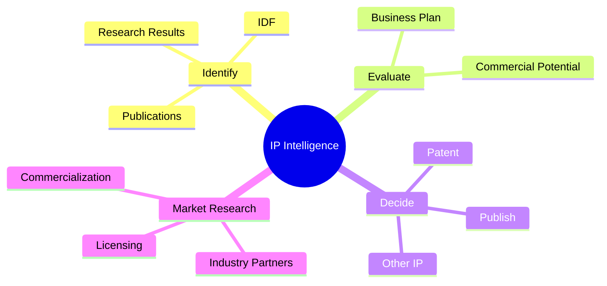
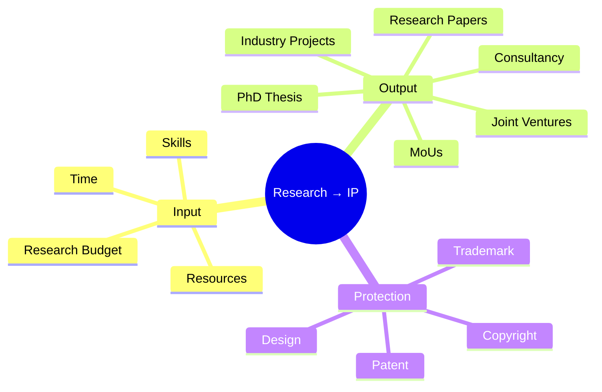

# [[01 Setting up IP Centre – Part 1]]

> [!SUMMARY]
> An **IP Centre** (also called an **IPM Cell**, **Technology Transfer Office (TTO)**, or **Technology Licensing Office (TLO)**) is established in a university to **identify, screen, protect, commercialize, and maintain Intellectual Property (IP)** generated through research. lec43.pdf

## Why Do Universities Need an IP Centre?

Universities need an IP Centre because:

- Research generates IP with commercial value.
- Improve **NIRF** and **ARIIA** rankings.
- Meet requirements of **UGC, AICTE, and NAAC**.
- Commercialize research outputs.
- Generate revenue through licensing and technology transfer.

> [!IMPORTANT]
> An IP Centre can become a **profit centre** by licensing patents and generating revenue for the university. lec43.pdf

## Role in Rankings

### NIRF (National Institutional Ranking Framework)

Research & Professional Practice (RP) considers:

- Publications
- Citations
- Patents filed
- Patents granted
- Patents licensed
- Collaborative projects

Setting up an IP Centre also indirectly improves:

- Employability
- Research funding
- Commercialization
- Overall institutional ranking

### ARIIA (Atal Ranking of Institutions on Innovation Achievements)

ARIIA evaluates:

- Awareness and promotion of innovation
- Support for idea generation
- Entrepreneurship development
- Intellectual Property generation
- Technology Transfer
- Commercialization

## What is an IP Centre?

An IP Centre is a **centre or office that manages Intellectual Property**.

It is also known as:

- IP Centre (IPC)
- IPM Cell (IPMC)
- Technology Transfer Office (TTO)
- Technology Licensing Office (TLO)

## Functions of an IP Centre

| Function | Purpose |
|----------|---------|
| **Identifying IP** | Awareness, education, identifying inventions |
| **Screening IP (IP Intelligence)** | Patentability search, commercial evaluation |
| **Protecting IP** | Patent, trademark, copyright, design registration |
| **Maintaining IP** | Renewal, enforcement, licensing, commercialization |

> [!NOTE]
> Universities may outsource patent filing, but **IP Intelligence (screening and evaluation)** should ideally remain within the institution. lec43.pdf

# Function 1: IP Education

IP Education consists of two broad areas:

## Awareness

- Clearing doubts on IPR.
- Forum for exchanging ideas and information.
- Workshops and expert lectures.

## Education

### Basic Education

- Types of IP.
- Identification of different IP rights.
- Basic understanding of patents, trademarks, copyrights, etc.

### Ongoing Education

Since IP law continuously evolves:

- Track new developments.
- Update faculty and students.
- Conduct periodic training.

### Advanced Education

For those pursuing careers in IP:

- Patent Agent preparation.
- IP Professional training.
- Advanced IP courses for faculty and students.

> [!TIP]
> IP Centres should provide **Basic → Ongoing → Advanced** IP education. lec43.pdf

# Function 2: IP Intelligence

IP Intelligence is the most important function of an IP Centre.

It includes:

### 1. Identify Research Results with Commercial Value

Sources include:

- Research projects
- Consultancy projects
- Industry collaborations
- Invention Disclosure Forms (IDFs)
- Research publications

> [!IMPORTANT]
> Publications should be **screened before publication**, otherwise patent rights may be lost due to loss of novelty. lec43.pdf

### 2. Evaluate Commercial Potential

The IP Centre prepares a **business plan** by evaluating:

- Existing market
- Competing technologies
- Commercial demand
- Ease of imitation
- Alternative technologies
- Cost-benefit analysis
- Investment vs expected returns

The evaluation also considers:

- Patent filing costs
- Foreign filing costs (PCT/Convention route)
- Commercialization potential
- Renewal costs

### 3. Decide Whether to Protect IP

The IP Centre decides:

- Whether protection is required.
- Which form of IP should be used.
- Whether publication is preferable.
- Whether a **Patentability Search Report** supports filing.

### 4. Market Research

The IP Centre:

- Identifies industry partners.
- Finds potential licensees.
- Negotiates commercialization.
- Supports consultancy and collaborative projects.

## Workflow of IP Intelligence

## Quick Revision

| Topic | Key Point |
|--------|-----------|
| Need for IP Centre | Research, rankings, regulations, revenue |
| Other Names | IPM Cell, TTO, TLO |
| Main Functions | Identify, Screen, Protect, Maintain IP |
| IP Education | Awareness, Basic, Ongoing, Advanced |
| IP Intelligence | Identify → Evaluate → Decide → Market Research |
| Commercial Evaluation | Business plan, market, cost-benefit analysis |
| Decision | Patent, publish, or use another form of IP |
| Market Research | Industry partners, licensing, commercialization |

---

# [[02 Setting up IP Centre – Part 2]]

> [!SUMMARY]
> **Part 2** focuses on the remaining functions of an IP Centre—**Registration and Maintenance**, the **objectives of an IP Centre**, **IP Policy**, and **different models of IP Centres**. An effective IP Centre not only protects IP but also commercializes research and promotes innovation. lec44.pdf

# Function 3: Registration

Registration is the process of obtaining legal protection for Intellectual Property.

## Which IP Requires Registration?

| IP Right          | Registration Required?       |
| ----------------- | ---------------------------- |
| Copyright         | No (automatic upon creation) |
| Trademark         | Yes                          |
| Industrial Design | Yes                          |
| Patent            |  Yes                         |

## Patent Registration Workflow

| Stage | Activity | Purpose |
|--------|----------|---------|
| 1 | Invention Disclosure Form (IDF) | Record invention details |
| 2 | Patentability Search Report | Check novelty and patentability |
| 3 | Decide Filing Type | Provisional or Complete Specification |
| 4 | Patent Filing | File application |
| 5 | Foreign Protection | PCT or Convention Application |

> [!IMPORTANT]
> Before filing a patent, the IP Centre evaluates whether a **Provisional Specification** or **Complete Specification** is more appropriate and whether foreign filing is commercially justified. lec44.pdf

# Function 4: Maintenance

Maintaining IP is as important as obtaining it.

## Components of IP Maintenance

| Activity | Purpose |
|----------|---------|
| Record Keeping | Maintain complete IP portfolio |
| Renewals | Keep IP rights alive |
| Surrender | Give up IP with no commercial value |
| Abandonment | Failure to renew |
| Withdrawal | Withdraw pending applications |
| Licensing | Commercialize granted IP |
| Enforcement | Protect IP against infringement |

## Licensing Models

| Model | Description |
|--------|-------------|
| Exclusive Licence | Rights granted to one licensee |
| Non-exclusive Licence | Rights granted to multiple licensees |
| Open Licensing | Industry can use technology under defined conditions |
| Patent Pool | Multiple patent owners cross-license related technologies |

## Enforcement (Litigation)

When infringement occurs, the IP Centre may:

- Send a **Cease-and-Desist Notice**
- File an **Infringement Suit**
- Initiate **Declaratory Proceedings**

> [!NOTE]
> Litigation is the legal mechanism for stopping unauthorized use of patented technology. lec44.pdf

# Research Output and IP Protection

Research spending is the **input**, while protected Intellectual Property is the **output**.

## Sources of IP

- Research projects
- Research papers *(before publication)*
- Ph.D. theses
- Consultancy projects
- Industry collaborations
- Joint ventures
- MoUs with research institutions

> [!IMPORTANT]
> Without research investment, there can be no meaningful IP generation. Protecting IP also encourages a stronger research culture. lec44.pdf

# Objectives of an IP Centre

The primary objective is **Research Commercialization**.

Other objectives include:

- Protect university innovations
- Facilitate technology transfer
- Encourage innovation
- Support commercialization
- Develop an institutional IP culture

## Mission of an IP Centre

| Objective | Purpose |
|-----------|---------|
| Research Commercialization | Convert research into marketable products |
| Technology Transfer | Connect university and industry |
| Economic Development | Create jobs and promote growth |
| Facilitation | Assist researchers throughout the IP process |

# Why is an IP Policy Needed?

An **IP Policy** provides clear rules governing IP management within an institution.

## Benefits of an IP Policy

| Benefit | Explanation |
|----------|-------------|
| Synchronizes Research | Common framework across departments |
| Aligns Institutional Mission | IP Centre supports university goals |
| Improves Research Quality | Incentivizes innovation and commercialization |
| Encourages Revenue Sharing | Motivates researchers |

> [!TIP]
> A clear IP Policy motivates researchers because successful commercialization often includes **revenue or profit sharing**. lec44.pdf

# Mission & Social Responsibility

An IP Centre should:

- Assist researchers in technology transfer.
- Promote commercialization for public benefit.
- Support economic development.
- Strengthen university–industry collaboration.
- Encourage socially beneficial research.

## Social Responsibility

The IP Policy should support:

- CSR initiatives
- UN Sustainable Development Goals (SDGs)
- Public welfare research
- Responsible innovation

# Structure of an IP Policy

| Section | Contents |
|---------|----------|
| Preamble | Purpose of the policy |
| Objectives | Goals of IP management |
| Definitions | Patent, Copyright, Trademark, Confidential Information |
| Ownership | Who owns different IP rights |
| IP Administration | Disclosure, IP Committee, Evaluation |
| Patent Filing | Local & PCT filings |
| Renewals & Assignments | Maintenance of IP |
| Commercialization | Licensing, Technology Transfer, Dissemination |
| Record Keeping | Portfolio management |
| Confidentiality | NDA, disclosure rules |
| Revenue / Profit Sharing | Distribution of commercialization income |
| Enforcement | Litigation procedures |
| Dispute Resolution | Internal IP dispute mechanism |

> [!IMPORTANT]
> Ownership rules may differ by IP type. For example, **copyright may remain with creators**, while **patents may belong to the institution** according to its IP Policy. lec44.pdf

# IP Administration

The IP Policy should define:

- Collection of disclosures
- Role of the IP Committee
- Evaluation of inventions
- PCT (foreign) filings
- Renewals
- Conversions
- Assignments

> [!NOTE]
> A **Patentability Search Report** should ideally be completed before converting a **Provisional Specification** into a **Complete Specification** to ensure strong patent quality. lec44.pdf

# Commercialization under IP Policy

Commercialization methods include:
- Licensing
- Open Licensing
- Technology Transfer
- Dissemination (Diffusion)

# Confidentiality

Confidentiality provisions ensure:
- Safe disclosure of inventions.
- Protection through **Non-Disclosure Agreements (NDAs)**.
- Preservation of patent novelty.

# Revenue vs Profit Sharing

| Revenue Sharing | Profit Sharing |
|-----------------|----------------|
| Share total revenue received | Share only remaining profit after deducting filing, maintenance and administrative expenses |

# Types of IP Centres

| Type | Description |
|------|-------------|
| Internal | Operated entirely by the university |
| External | Managed by an outside organization |
| Mixed (Hybrid) | Combination of internal staff and outsourced functions |

# Need for an IP Centre

Universities establish IP Centres because of:

- Regulatory requirements
- Research commercialization
- Better research quality
- Technology transfer
- Innovation ecosystem
- Industry collaboration

> [!NOTE]
> Generally, **Applied Research** is commercialized, whereas **Basic Research** is primarily disseminated through publications. lec44.pdf

# AUTM: Reasons for Technology Transfer

According to the **Association of University Technology Managers (AUTM)**:

| Reason | Benefit |
|---------|---------|
| Commercialization for Public Good | Society benefits from research |
| Reward & Retain Researchers | Attract high-quality talent |
| Industry Collaboration | Stronger university–industry ties |
| Generate Income | Revenue supports future research |

# Quick Revision

| Topic | Key Point |
|--------|-----------|
| Registration | IDF → Patentability Search → Filing → PCT |
| Maintenance | Record Keeping, Renewals, Licensing, Enforcement |
| Main Objective | Research Commercialization |
| IP Policy | Governs ownership, management and commercialization |
| Commercialization | Licensing, Technology Transfer, Dissemination |
| Confidentiality | NDA preserves novelty |
| Sharing Models | Revenue Sharing vs Profit Sharing |
| Types of IP Centres | Internal, External, Mixed |
| AUTM Benefits | Public Good, Talent, Industry Links, Research Funding |

---